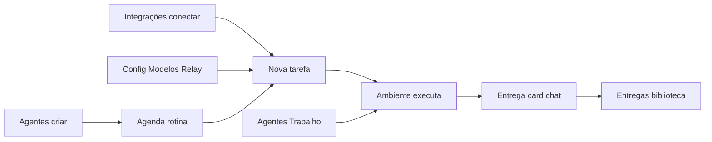
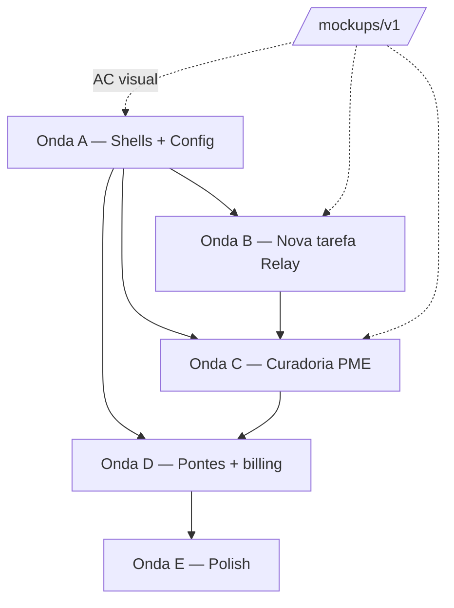

# Auditoria Produto Work4You v1

> **LIXO para direção de produto atual (23/07/2026).**  
> Norte canónico: [`PRODUTO.md`](./PRODUTO.md) (Work + Agent Studio).  
> Esta auditoria (prints / mockups / Fase 10) é arquivo histórico — **não** seguir
> para decidir Work vs Studio, canvas, ou escopo v1.

Documento mestre da auditoria de produto (prints → UX → código → benchmark → gap → spec → prioridade).

**Restrição:** auditoria/spec concluída na Fase 10 — **implementação liberada por ondas** (A→E). Mockups `/mockups/v1` = acceptance criteria visual.

**Legenda de vereditos:** ✅ manter · ⚖️ ajustar · 🔒 gated por plano · ❌ remover da jornada · 🐛 bug · 📋 spec nova

---

## Índice de fases

| Fase | Módulo | Status |
|------|--------|--------|
| 0 | Índice de evidências (81 prints + wireframes) | ✅ |
| 1 | Nav / IA v1 | ✅ |
| 2 | Nova tarefa | ✅ + addendum |
| 3 | Entregas (ex-Arquivos) | ✅ |
| 4 | Agenda | ✅ |
| 5 | Integrações | ✅ |
| 6 | Agentes | ✅ |
| 7 | Config + billing | ✅ + benchmark + **Cursor sidebar parity** |
| 8–9 | Consolidação + wireframes v2 | ✅ |
| 9b | Mockups interativos (`/mockups/v1`) | ✅ |
| 10 | Roadmap de implementação | ✅ |

Transcript completo: `agent-transcripts/7d1f58e8-1b14-41b3-95af-0bd0a03ef0e3.jsonl`

---

## Fase 0 — Evidências (resumo)

| Grupo | ID | Qtd | Módulo |
|-------|-----|-----|--------|
| A | E-A01–04 | 4 | Shell desktop |
| B | E-B01–10 | 10 | Nova tarefa (hero) |
| C | E-C01–10 | 10 | Nova tarefa (sessão) |
| D | E-D01 | 1 | Arquivos |
| E | E-E01–05 | 5 | Agenda |
| F | E-F01–13 | 13 | Integrações |
| G | E-G01–22 | 22 | Agentes |
| H | E-H01–16 | 16 | Config |
| I | E-I01–04 | 4 | Relay / Cursor model ref |

Assets: `.cursor/projects/c-DEV-W4Y-Labs/assets/`

---

## Fase 1 — Nav / IA v1 (resumo)

**Sidebar proposta:**

- Nova tarefa → `/chat?new=1`
- **Entregas** → `/files` (rename de Arquivos)
- **Integrações** → item único · abas **Conectores · Habilidades · Canais** *(sem dropdown)*
- **Agentes** → item único · abas **Equipe · Trabalho · Governança** *(sem dropdown)*
- Operações **não** é item de sidebar — vive dentro de Agentes → aba Trabalho
- Agenda → `/cron`
- Avatar → Config · Plano · Idioma · Conquistas ⚖️
- **Modelos** entram em **Config** (sidebar flat estilo Cursor) — não só `?full=1` *(correção 21/07)*

**Três planos de controle:** Execução (chat) · Personalização (Integrações + Config) · Governança (Operações + billing).

**Ocultar da nav default (manter rotas):** workflow canvas, org chart primário, duplicatas Config↔Integrações, Sessions/Logs/Keys → `?full=1`. **`/models` migra para Config → Modelos** (rota admin/analytics pode permanecer em `?full=1`).

---

## Fase 2 — Nova tarefa

### Veredito geral

Melhor superfície do produto. Motor upstream forte; gaps = TierPicker comercial, colisão “Auto”, header Utilização/⋯, densidade precoce no hero.

### Decisões fechadas

| Tópico | Decisão |
|--------|---------|
| Model bar | Substituir TierPicker → **Relay + Auto + MAX** (ver spec Relay) |
| Aprovações | Renomear `modeAuto` — nunca duas chips “Auto” na mesma linha |
| E-C08 entregas | Card no chat + dock Saídas + biblioteca Entregas |
| E-C09 utilização | Footer abaixo do composer (estilo Cursor/Claude), não popover no header |
| E-C10 menu ⋯ | Toolbar unificada no **Painel Ambiente**, não header global |
| E-B01 boot | Outro dev — fora desta auditoria |

### Bugs registrados

| ID | Sev. | Item |
|----|------|------|
| BUG-NT-01 | P0 | Popover Utilização quebrado (E-C09) |
| BUG-NT-02 | P0 | Menu ⋯ header (E-C10) |
| BUG-NT-03 | P1 | Sessão cloud sem header actions |
| BUG-NT-04 | P1 | Sessão cloud sem ModePicker |
| BUG-NT-05 | P2 | EN residual no activity stream |
| BUG-NT-06 | P2 | Tier muda só em `/new` |

### Backlog Nova tarefa (implementação futura)

**P0:** ModelPopover Relay · renomear ModePicker · toolbar Ambiente · usage footer · auto expand/collapse dock  
**P1:** Card artefato xlsx · remover badge Flash/Expert · dock colapsado no hero · cloud header  
**P2:** i18n EN · créditos no footer

---

## Fase 2 — Addendum: Ambiente Codex + diferenciação

> Registrado após revisão: benchmark primário é **Codex**, não Cursor. Cursor e Claude entram como empréstimos pontuais.

### Modelo de referência

| Produto | Papel no Work4You |
|---------|-------------------|
| **Codex** | Esqueleto do **Painel Ambiente** — pilha reativa (não abas fixas como nav principal) |
| **Cursor** | Browser/Terminal embarcados · usage abaixo do prompt · colapsar no hero |
| **Claude Cowork** | Cards de entrega no chat · processos bg nomeados · notificação ao concluir |

### Arquitetura Ambiente v1 (pilha Codex)

```
┌─ Ambiente (colapsável) ─────────────────────────────┐
│ Ambiente                          [toolbar unificada]│
│ ─ Alterações (+/−) · branch · PR    [camada dev]    │
│ ─ Subagentes (perfis nomeados)      [CORE — manter] │
│ ─ Processos em segundo plano        [Claude layer]  │
│ ─ Navegador / Terminal              [Cursor layer]  │
│   (expandem inline; sub-abas quando múltiplos)      │
│ ─ Fontes · Saídas · Entregas        [camada PME]    │
└─────────────────────────────────────────────────────┘
```

### Subagentes — decisão explícita ✅

**Manter e reforçar.** Diferencial vs Cursor/Cowork.

| Camada | Comportamento |
|--------|---------------|
| Header Ambiente | Chip `N agentes` + dot live durante delegação |
| Seção Subagentes | Lista com perfil nomeado, status, tempo, expand inline (spectator) |
| Auto-focus | `subagent.start` → expande seção Agentes (ou abre painel se fechado) |
| Chip colapsado | `"2 agentes · Ambiente"` persiste enquanto houver ativos |

Codex mostra avatares anônimos + “N concluídos”. Work4You mostra **perfis de `/profiles`** (“Analista Financeiro”, não flor genérica).

### Processos em segundo plano

Upstream: `terminal(background=true, notify_on_complete=true)`.

| Codex | Work4You alvo |
|-------|---------------|
| Comando cru (`git show…`) | Label humano + comando expandível |
| Lista terminal | Também cron + delegate_task async na mesma seção |
| Sem notificação clara | Volta ao chat ao concluir (gateway watcher) |

### Ciclo de vida do painel

| Estado | Painel |
|--------|--------|
| Hero idle | Fechado (só handle na borda) |
| Tool dispara | Abre + expande seção relevante |
| `message.complete` | Colapsa ~3s se usuário não interagiu |
| Subagentes ativos pós-collapse | Chip persiste até todos `complete` |

### Cinco diferenciais de produto

1. **Ambiente de negócio** — conectores, entregas, rotinas; git para dev.
2. **Equipe visível** — subagentes = perfis contratáveis.
3. **Um motor, todos os canais** — local/nuvem + origem WhatsApp/Telegram no Ambiente.
4. **Operação durável** — background + cron + kanban + Operações.
5. **Relay + planos BR** — Hobby Auto-only, Pro MAX/BYOK, créditos legíveis.

### Matriz plano × seções Ambiente

| Seção | Hobby | Pro | Business |
|-------|-------|-----|----------|
| Subagentes | ✅ | ✅ | ✅ + Operações |
| Processos bg | ✅ | ✅ | ✅ + audit |
| Saídas / Entregas | ✅ | ✅ | ✅ |
| Fontes / conectores | ✅ | ✅ | ✅ |
| Browser / Terminal | on use | ✅ | ✅ |
| Alterações / git / PR | colapsado | ✅ | ✅ + governança |

---

## Fase 3 — Entregas (ex-Arquivos)

**Escopo:** E-D01 + ponte E-C08 + bloco Saídas do Ambiente + POC `model-experience-poc`  
**Veredito geral:** ⚖️ **Explorer sólido, camada Entregas inexistente** — hoje é filesystem para devs; PME precisa de biblioteca de outputs de negócio.

### 1. O que o print mostra (E-D01)

Explorador estilo desktop:

- Rail: Início · Projetos · Conhecimento dos agentes · Favoritos
- Grid/lista de pastas e arquivos
- Upload · nova pasta · recentes
- Linguagem técnica (“pasta vazia”, paths)

**Veredito E-D01:** ⚖️ Bom para **workspace técnico**; ❌ como **produto PME-facing “Arquivos”** na nav principal.

### 2. Mapa código

| Superfície | Arquivo | Função hoje |
|------------|---------|-------------|
| Página | `web/src/pages/FilesPage.tsx` | Explorer `/api/files` |
| Rail | `web/src/components/files/FilesRail.tsx` | Quick access, projetos, knowledge |
| Curadoria | `web/src/lib/file-curation.ts` | Oculta ruído de sistema (`cron`, `sessions`, `.venv`…) |
| Preview | `web/src/components/files/FilePreview.tsx` | PDF, imagem, texto |
| Card no chat | `web/src/components/chat/FileRefCard.tsx` | MEDIA:/paths → download/preview |
| Dock | `RightDock` bloco **Saídas** | Agrega outputs da sessão atual |
| Deep links | `?path=`, `?src=knowledge&agent=` | TaskHeader → `projects/<slug>` |
| Nav | `App.tsx` | Label `files` → “Arquivos” |
| POC | `model-experience-poc/TasksPage.tsx` | Seção **Entregas** com xlsx/pdf + data |

### 3. Benchmark

| Capacidade | Cursor | Claude Cowork | Codex | Work4You hoje | Alvo v1 |
|------------|--------|---------------|-------|---------------|---------|
| Outputs no chat | Referências + abrir editor | Artifact cards | Links | `FileRefCard` ⚖️ | ✅ cards ricos |
| Biblioteca persistente | Workspace git | Artifacts panel | Fontes | Explorer only | **Entregas** |
| Preview inline | Editor | Artifact viewer | iframe html | PDF/img/text | + thumb xlsx |
| Agrupar por tarefa | Session implicit | Por conversa | Por repo | Por pasta projeto | **Por tarefa/sessão** |
| Linguagem PME | Dev | Negócio | Dev | Mista | **Entregas** |
| Workspace técnico | ✅ | Oculto | ✅ | ✅ FilesPage | 🔒 `?full=1` ou sub-aba |

### 4. Diagnóstico — duas camadas necessárias

Hoje tudo vive numa camada só (`/api/files` = WAYNE_HOME). O usuário PME não distingue `projects/foo/report.xlsx` de infra `sessions/…`.

**Spec: duas camadas na mesma rota `/files` (nav “Entregas”):**

| Camada | Público | Conteúdo | UI default |
|--------|---------|----------|------------|
| **Entregas** | PME + todos | Outputs gerados pelo agente: planilhas, PDFs, decks, exports | **Tab/default** |
| **Workspace** | Pro/dev | `projects/`, uploads, drag-drop, git-adjacent | Sub-aba ou link “Workspace avançado” |
| **Sistema** | Interno | `cron`, `sessions`, caches | Só `?full=1` (já curado em `file-curation.ts`) |

### 5. Modelo de dados Entregas (spec — sem backend novo na v1 mínima)

**v1 lean (index sobre filesystem existente):**

Metadados derivados de:

1. `MEDIA:` / `@session:` / bare paths parseados (`FileRefCard.extractFileRefs`)
2. Eventos `message.complete` + tool writes da sessão
3. Scan `projects/*/outputs/` ou convenção `deliverables/` por projeto (convencionar no skill/prompt)

Campos por entrega:

| Campo | Exemplo |
|-------|---------|
| `name` | `Relatório vendas outubro.xlsx` |
| `type` | spreadsheet / pdf / doc / image / site |
| `session_id` | link → retomar tarefa |
| `project` | slug opcional |
| `created_at` | mtime |
| `agent` | perfil que produziu |
| `path` | interno — não expor na UI PME |

**v2 (durável):** tabela SQLite `deliverables` no tenant — sobrevive rename/move, suporta share link Enterprise.

### 6. UX Entregas v1 (wire textual)

**Home `/files` (Entregas):**

```
Entregas                                    [Buscar] [Filtro ▾]
─────────────────────────────────────────────────────────────
Hoje
  📊 Relatório vendas outubro.xlsx    Pesquisa mercado · há 2h   [Baixar] [Abrir tarefa]
  📄 Resumo executivo.pdf             Pesquisa mercado · há 2h   [Baixar] [Abrir tarefa]

Esta semana
  …

[Ver workspace avançado →]     (Pro/dev ou expandir rail)
```

**Filtros:** tipo · agente · projeto · período · “desta tarefa” (query `?session=`).

**Empty state PME:** “Quando a Work4You terminar uma planilha, PDF ou site, ele aparece aqui.” — não “Pasta vazia”.

### 7. Pontes obrigatórias (Fase 2 ↔ Fase 3)

| Origem | Ponte | Destino |
|--------|-------|---------|
| Chat `FileRefCard` | botão **Ver em Entregas** | `/files?highlight=<path>` ou `?session=` |
| Dock Saídas | mesmo card + link | Entregas |
| TaskHeader 📁 | hoje → `projects/<slug>` | → Entregas filtradas por projeto |
| `openInFilesApp` i18n | rename copy | “Ver em Entregas” |
| Agent skill | emitir `MEDIA:` sempre | garante indexação |

### 8. Vereditos por feature existente

| Feature FilesPage | Veredito | Ação |
|-------------------|----------|------|
| Explorer grid/list | ✅ | Manter em sub-aba Workspace |
| FilesRail projetos | ✅ | Manter no Workspace |
| Knowledge section | ⚖️ | Mover emphasis → Agentes; link secundário aqui |
| Recentes (mtime scan) | ⚖️ | v1 Entregas: recentes = **outputs**, não qualquer arquivo |
| Upload / mkdir / drag | ✅ | Workspace only |
| file-curation | ✅ | Manter — crítico para não expor infra |
| Favoritos | ⚖️ | Entregas: “Fixados”; Workspace: favoritos path |
| Preview overlay | ✅ | Reutilizar `FilePreview` |
| Deep link `?path=` | ✅ | Workspace |
| PluginSlot files:top/bottom | ✅ | Extensível |

### 9. Gaps vs POC

O POC (`TasksPage` → `<Artifacts />`) já mostra o produto desejado:

- Título **Entregas** com contagem
- Cards horizontais: ícone tipo · nome · “Gerado hoje, 10:22” · download
- Contexto da tarefa implícito

**Gap:** POC não está wired no dashboard real — `FilesPage` substituiu a narrativa por explorer.

### 10. Matriz plano × Entregas

| Feature | Hobby | Pro | Business |
|---------|-------|-----|----------|
| Ver Entregas | ✅ | ✅ | ✅ |
| Download | ✅ | ✅ | ✅ |
| Preview PDF/img/text | ✅ | ✅ | ✅ |
| Preview xlsx (read-only) | ⚖️ | ✅ | ✅ |
| Filtrar por tarefa/agente | ✅ | ✅ | ✅ |
| Compartilhar link | ❌ | ⚖️ | ✅ |
| Workspace explorer | 🔒 limitado | ✅ | ✅ |
| Knowledge docs no rail | ⚖️ | ✅ | ✅ |
| Retention / arquivo | 30d | 1a | ilimitado + audit |

### 11. Copy pt-BR

| Chave atual | Proposta |
|-------------|----------|
| `nav.files` → “Arquivos” | **“Entregas”** |
| `files.empty` → “Pasta vazia” | **“Nenhuma entrega ainda”** (+ subtítulo orientador) |
| `chat.openInFilesApp` | **“Ver em Entregas”** |
| `chat.dockOutputs` | Manter **“Saídas”** no Ambiente (sessão atual) vs **“Entregas”** (biblioteca global) |

Distinção proposital:

- **Saídas** = desta conversa (dock, efêmero até indexar)
- **Entregas** = biblioteca cross-session

### 12. Registro de bugs / gaps (Entregas)

| ID | Sev. | Gap |
|----|------|-----|
| GAP-EN-01 | P0 | Nav diz “Arquivos” mas produto promete entregas de negócio |
| GAP-EN-02 | P0 | xlsx sem card quando agente cita path sem `MEDIA:` |
| GAP-EN-03 | P0 | Sem agrupamento por tarefa/sessão |
| GAP-EN-04 | P1 | `openInFilesApp` abre explorer, não entrega |
| GAP-EN-05 | P1 | Recentes mistura outputs com ruído de projeto |
| GAP-EN-06 | P2 | Sem share link / export pack Enterprise |

### 13. Backlog Fase 3 (implementação futura)

**P0**

1. Rename nav + i18n: Arquivos → **Entregas**
2. Tab/default **Entregas** com lista derivada de outputs (index v1)
3. Card chat: **Ver em Entregas** + garantir token `MEDIA:` no skill de entrega
4. Empty state + copy PME
5. Filtro `?session=` desde chat/dock

**P1**

6. Sub-aba **Workspace** (explorer atual, quase sem mudança)
7. Agrupar por data + por tarefa
8. Thumbnail xlsx (SheetJS read-only ou ícone rico + metadata)
9. TaskHeader 📁 → Entregas filtradas por projeto

**P2**

10. SQLite `deliverables` v2
11. Share link Enterprise
12. Export zip “todas entregas da tarefa”

### 14. Definition of Done — Fase 3

- [x] E-D01 auditado
- [x] Duas camadas especificadas (Entregas vs Workspace)
- [x] Pontes E-C08 + Saídas + FileRefCard
- [x] Benchmark na mesma tabela
- [x] Matriz plano × feature
- [x] Backlog P0–P2
- [x] Addendum Fase 2 registrado neste doc

---

## Fase 4 — Agenda (Rotinas)

**Escopo:** evidências E-E01–05 · upstream `cron/` · UI `CronPage` + blueprints  
**Veredito geral:** ✅ **Superfície madura** — benchmark Claude Routines bem executado; gaps = **templates EN + chips dev**, **ponte Agentes↔Agenda**, e **narrativa PME BR**.

### 1. Evidências (E-E01 → E-E05)

| ID | Superfície provável | Veredito | Gap principal |
|----|---------------------|----------|---------------|
| **E-E01** | Composer hero — “O que você quer automatizar?” + chips | ✅ | Chips falam de **PR/issues/release notes** (dev) |
| **E-E02** | Lista `RoutineCard` — agente, schedule humano, pause/trigger | ✅ | Falta link → drawer do agente |
| **E-E03** | Galeria “Ou comece com um modelo” | ⚖️ | **14 blueprints 100% EN** (backend) |
| **E-E04** | Tab **Calendário** (`RoutineCalendar`) | ✅ | Nome “Agenda” na nav vs “Rotinas” no header — ok com toggle |
| **E-E05** | Modal criar/editar + picker agente + schedule builder | ✅ | Strings EN residuais (“Skills optional”, toasts validação) |

### 2. Mapa código

| Superfície | Arquivo | Função |
|------------|---------|--------|
| Página Agenda | `web/src/pages/CronPage.tsx` | Composer, lista, calendário, modais |
| Blueprints UI | `web/src/components/AutomationBlueprints.tsx` | Galeria → POST `/api/cron/blueprints/instantiate` |
| Catálogo backend | `cron/blueprint_catalog.py` | 14 templates + slots tipados |
| Curadoria jobs | `web/src/lib/cron-curation.py` | Oculta jobs `__` / `sys:` (como Files) |
| Schedule builder | `web/src/lib/schedule.ts` | Diário/semanal/mensal — **sem cron cru** para PME |
| Calendário | `web/src/components/agenda/RoutineCalendar.tsx` | Projeção client-side por agente/cor |
| Rotinas no agente | `web/src/components/agents/AgentDrawer.tsx` tab `schedule` | CRUD por perfil (duplicata parcial) |
| Schedule picker | `web/src/components/agents/AgentSchedulePicker.tsx` | Mesmo builder, reutilizado |
| API | `web/src/lib/api.ts` | `/api/cron/jobs`, delivery-targets, blueprints |
| Motor upstream | `cron/jobs.py`, `cron/scheduler.py` | Tick, catchup, 3min interrupt, `context_from` |
| Cloud merge (S2) | `CronPage` + `cloudSession.ts` | Desktop local: rotinas na **nuvem** por default 24/7 |

### 3. Benchmark

| Capacidade | Claude Cowork | Cursor | Codex | Work4You hoje | Alvo v1 |
|------------|---------------|--------|-------|---------------|---------|
| Input natural (“automatizar…”) | ✅ Routines | Limitado | — | ✅ composer | ✅ |
| Templates prontos | ✅ EN | — | — | ⚖️ 14 EN dev-adjacent | **8 featured PT-BR** |
| Lista + pause/run | ✅ | — | — | ✅ RoutineCard | ✅ |
| Calendário visual | ⚖️ | — | — | ✅ RoutineCalendar | ✅ |
| Por agente/perfil | Implícito | — | — | ✅ filtro + cor | ✅ + link Agentes |
| Entrega multicanal | Chat | — | — | ✅ deliver targets | ✅ + link Canais |
| Roda com app fechado | Cloud | — | — | ✅ cloud default desktop | ✅ comunicar claro |
| Webhook/API trigger | Limitado | — | — | ⚖️ subtitle menciona; **sem link UI** | Link Integrações |
| Cadeia de jobs | — | — | — | 🔒 `context_from` só `?full=1` | Ok Enterprise |

**Referência explícita no código:** `CronPage` header comment — *“faithful to Claude's Routines”*.

### 4. O que já funciona bem (manter)

| Feature | Por quê |
|---------|---------|
| Composer + chips → drawer pré-preenchido | Jornada Cowork correta |
| `ScheduleBuilder` humano (diário 9h, semanal…) | PME não digita cron |
| `RoutineCard` com schedule legível + próxima execução | ✅ |
| Filtro **Todos os agentes** / por perfil | Diferencial vs Cowork |
| Tab Calendário colorido por agente | “Agenda” de verdade |
| Cloud create default no desktop | Produto 24/7 — copy `createdInCloud` já boa |
| `partitionJobs` | Esconde jobs de plataforma |
| Campos técnicos atrás `?full=1` | Alinhado curadoria PME |
| AgentDrawer tab Agenda | Rotinas **por funcionário** — certo conceitualmente |

### 5. Gaps auditados

#### GAP-AG-01 — Blueprints em inglês (P0)

Backend `blueprint_catalog.py` — títulos, descrições e labels de slot em EN:

- *Morning briefing*, *Important-mail monitor*, *Weekly review*, …
- Slot labels: *“What time?”*, *“Where to deliver?”*, weekday enums *sunday/monday*…

UI renderiza **texto cru da API** — sem camada i18n.

**Spec v1:** overlay pt-BR no frontend (`blueprint.i18n.ts`) **ou** campo `title_pt` no catalog; **destaque 6–8 modelos BR** no topo:

| Modelo featured | Público |
|-----------------|---------|
| Briefing matinal | PME geral |
| Monitor de e-mail importante | Operações |
| Revisão semanal | Gestores |
| Lembrete contas/renovações | Financeiro |
| Resumo de notícias (tema) | Marketing |
| Plano de refeições semanal | Consumer/lifestyle |
| *Manter* PR/issue templates | 🔒 seção “Desenvolvimento” colapsada |

#### GAP-AG-02 — Chips do composer dev-centric (P0)

`pt.ts` chips atuais:

```
chip1: "Resumir meus PRs abertos toda manhã…"
chip2: "Triar novos issues…"
chip3: "Rascunhar release notes…"
```

**Spec:** substituir por exemplos PME (auditados):

- *“Todo dia útil às 8h, resuma meus e-mails importantes”*
- *“Toda segunda, monte um relatório da semana anterior”*
- *“Avisar quando vencer contas a pagar esta semana”*

Manter chips dev em `?full=1` ou categoria colapsada “Desenvolvimento”.

#### GAP-AG-03 — Agentes ↔ Agenda desconectados (P0)

Duas superfícies fazem a mesma coisa sem ponte:

| Onde | O quê |
|------|-------|
| `/cron` | Todas rotinas, filtro agente |
| `AgentDrawer` → tab Agenda | Rotinas **deste** agente only |

**Spec v1:**

- `RoutineCard` → link **“Ver agente”** → `/profiles?agent=<slug>&tab=schedule`
- `AgentDrawer` empty state → **“Ver na Agenda”** → `/cron?profile=<slug>`
- Filtro agente na Agenda respeita deep link `?profile=` (hoje só `?workdir=`)

#### GAP-AG-04 — EN residual na UI (P1)

| Local | String |
|-------|--------|
| `CronJobFormFields` | `"Skills (optional)"`, `"No skills installed…"` |
| Validação create | `"no_agent jobs require a script"` |
| Deliver hint | fallback EN se `delivery.noneConfigured` ausente |
| `getJobTitle` fallback | `"Cron job"` |

Migrar para `t.cron.*`.

#### GAP-AG-05 — Subtitle promete API/webhook sem CTA (P1)

`routinesSubtitle`: *“…por agendamento, API ou webhook”* — mas `CronPage` não linka **Webhooks** nem documentação.

**Spec:** link **“Disparar por webhook →”** para `/webhooks` (ou Integrações quando unificado).

#### GAP-AG-06 — Nova tarefa não sugere rotina (P2)

Após tarefa recorrente bem-sucedida, não há CTA *“Repetir toda semana?”* → `/cron` pré-preenchido.

**Spec:** card pós-turno ou menu ⋯ da tarefa → **“Agendar rotina”** (prompt + agente da sessão).

#### GAP-AG-07 — Ambiente “processos bg” ≠ rotinas (P2 doc)

Usuário pode confundir **processo terminal bg** (Ambiente) com **rotina cron** (Agenda).

**Spec copy:** Ambiente = *“Executando agora”* · Agenda = *“Vai rodar de novo”*.

### 6. Diferenciação Work4You (vs Claude Cowork)

| Diferencial | Detalhe |
|-------------|---------|
| **Funcionário digital** | Rotina amarrada a **perfil** (`/profiles`), não caixa genérica |
| **Multicanal** | Entregar no Telegram, Discord, Slack, e-mail — Cowork = chat |
| **Nuvem 24/7** | Desktop cria na cloud por default; copy honesta local fallback |
| **Calendário por equipe** | Cores por agente — visão gestor |
| **Mesmo motor** | Blueprint = cron job = tool `cronjob` — uma engine |
| **Enterprise** | `context_from`, script-only jobs, toolsets — `?full=1` + Operações |

Não competir removendo complexidade — **camadas por plano**.

### 7. Arquitetura informacional

```
Agenda (/cron)                    Agentes (/profiles)
├── Composer (peça)               └── Drawer → tab Agenda
├── Rotinas (lista)                      └── Criar rotina inline
├── Calendário                           └── Link "Ver na Agenda"
└── Modelos (blueprints)
         ↕ deep link ?profile=
Integrações                         Nova tarefa (futuro)
├── Canais (deliver targets)        └── "Agendar rotina" pós-sucesso
└── Webhooks (trigger externo)
```

**Nav:** manter label **“Agenda”** (`nav.cron`) — correto para PME; header interno **Rotinas | Calendário** — ok.

### 8. Matriz plano × Agenda

| Feature | Hobby | Pro | Business |
|---------|-------|-----|----------|
| Criar rotinas | ✅ cap N | ✅ | ✅ |
| Composer + modelos featured | ✅ | ✅ | ✅ |
| Calendário | ✅ | ✅ | ✅ |
| Entrega Telegram/WhatsApp/etc | ⚖️ 1 canal | ✅ | ✅ |
| Rotina na nuvem 24/7 | ⚖️ | ✅ | ✅ |
| Por agente (multi-profile) | ⚖️ 2 agentes | ✅ | ✅ |
| Blueprints dev (PR, CI…) | ❌ | ⚖️ | ✅ |
| Webhook trigger | ❌ | ✅ | ✅ |
| `context_from` / script-only | ❌ | 🔒 | ✅ |
| Audit log rotinas | ❌ | ❌ | ✅ |

### 9. Copy pt-BR — ajustes auditados

| Chave / área | Hoje | Proposta |
|--------------|------|----------|
| `cron.routinesSubtitle` | menciona API/webhook | + link CTA |
| `cron.chip1–3` | PR/issues | exemplos PME (§ GAP-AG-02) |
| Blueprint titles | EN API | overlay PT |
| `cron.newJob` legacy | “Nova tarefa cron” | só `?full=1`; UI usa **Nova rotina** ✅ |
| AgentDrawer tab | `nav.cron` = Agenda | ✅ manter |

### 10. Registro bugs / gaps

| ID | Sev. | Item |
|----|------|------|
| GAP-AG-01 | **P0** | Blueprints EN |
| GAP-AG-02 | **P0** | Chips dev no composer |
| GAP-AG-03 | **P0** | Ponte Agentes ↔ Agenda |
| GAP-AG-04 | P1 | Strings EN no form |
| GAP-AG-05 | P1 | Webhook/API sem link |
| GAP-AG-06 | P2 | CTA agendar desde Nova tarefa |
| GAP-AG-07 | P2 | Copy Ambiente vs Agenda |

### 11. Backlog Fase 4 (implementação futura)

**P0**

1. Overlay i18n blueprints + **6–8 featured BR** no topo
2. Chips composer PME
3. Deep link `?profile=` + links bidirecionais AgentDrawer ↔ `/cron`
4. Seção dev blueprints colapsada (default PME)

**P1**

5. i18n form fields + toasts validação
6. CTA webhook → `/webhooks`
7. Empty Agenda → sugestão de 1º modelo (não só texto vazio)

**P2**

8. “Agendar rotina” pós-tarefa no chat
9. Notificação desktop quando rotina cloud completa (complementa processos bg)
10. Audit Enterprise

### 12. Definition of Done — Fase 4

- [x] E-E01–05 mapeados com veredito
- [x] Benchmark Cowork/Cursor na mesma tabela
- [x] Código upstream + UI mapeados
- [x] Gaps blueprints/chips/ponte Agentes documentados
- [x] Diferenciação vs Cowork explicitada
- [x] Matriz plano × feature
- [x] Backlog P0–P2

---

---

## Fase 5 — Integrações

**Escopo:** E-F01–13 · Conectores · Habilidades · Canais · hub `/plugins`  
**Veredito geral:** ⚖️ **Motor e curadoria parciais existem** — três planos bem separados no código; a jornada PME quebra no **catálogo flat de 1.047 apps** e na **IA duplicada** (hub vs filhos vs Config).

### 1. Arquitetura dos três planos (decisão de produto)

| Plano | Rota nav | O quê | Analogia PME |
|-------|----------|-------|--------------|
| **Conectores** | `/mcp` | Apps OAuth (Composio) — Gmail, Sheets, Notion… | “Ligar minhas contas” |
| **Habilidades** | `/skills` | Métodos instaláveis (optional-skills marketplace) | “Ensinar um jeito de trabalhar” |
| **Canais** | `/channels` | Gateway inbound — WhatsApp, Telegram… | “Onde clientes falam comigo” |

**Regra de ouro** (já documentada em `docs/SKILLS-AUDITORIA.md`):

- Credencial de serviço externo → **Conector**, não skill  
- Método/script que roda no container → **Habilidade**  
- Bot/token de mensageria → **Canal** (não confundir com Conector Composio)

**Meu MCP / API customizada:** terceiro eixo — **extensão power user** via `HubActions` + `McpPage` (`?full=1`). Não é o default PME.

### 2. Mapa de rotas e superfícies

| Rota | Componente | Quem vê |
|------|------------|---------|
| `/plugins` | `PluginsHub` | Hub Manus: carousel + 8 cards + Gerir/Criar |
| `/mcp` | `ConnectorsPage` | Catálogo **completo** Composio (~1.047 apps, 87 categorias) |
| `/mcp?full=1` | `McpPage` | MCP técnico (stdio/HTTP, catálogo Nous) |
| `/skills` | `SkillsPage` → `SkillMarketplace` | Marketplace ~10 featured / ~102 full (`?full=1`) |
| `/channels` | `ChannelsPage` | Canais featured + “Ver todos” |
| Config → Personalizar | embed `SkillsPage`, `ConnectorsPage`, `ChannelsPage`, `PluginsPage` | ⚖️ **Duplica nav** |
| Nova tarefa | `ConnectorsPicker` | Toggle sessão dos apps já conectados |

**Escopo Global × Agente:** Conectores e Canais — mesma conta OAuth/bot por perfil ou global (`useConnectors`, `ChannelsPage`).

### 3. Evidências (E-F01 → E-F13)

| ID | Superfície provável | Veredito | Gap |
|----|---------------------|----------|-----|
| **E-F01** | Nav **Integrações** (grupo `/plugins`) | ⚖️ | Âncora cai no hub; filho **Conectores** abre flat 1.047 |
| **E-F02** | `PluginsHub` + `UseCaseCarousel` | ✅ | 6 casos PT (`ucEmail`, `ucSheets`…) → `/chat?ask=` |
| **E-F03** | `ConnectorsPage` grid + 87 chips categoria | ❌ PME | Overwhelming; categorias EN da API |
| **E-F04** | `ConnectorCard` OAuth Connect Link | ✅ | White-label Work4You; poll até ACTIVE |
| **E-F05** | `ConnectorEventsPanel` (triggers) | ✅ | Diferencial vs Cowork |
| **E-F06** | `SkillMarketplace` | ⚖️ | Nomes/descrições **EN originais** (decisão 10/07) |
| **E-F07** | `PluginsHub` row Habilidades (8 cards) | ✅ | “Ver tudo” expande |
| **E-F08** | `ChannelsPage` featured WhatsApp primeiro | ✅ | Curadoria BR-aware |
| **E-F09** | Modal config canal / QR Telegram | ✅ | Copy PT via `platformCopy` |
| **E-F10** | `HubActions` Gerir / Criar → MCP | ⚖️ | **Só no hub** `/plugins` — invisível em `/mcp` |
| **E-F11** | Selector Global / Agente | ✅ | Correto; precisa tooltip PME |
| **E-F12** | Config → Personalizar (4 páginas) | ❌ | Duplica sidebar Integrações |
| **E-F13** | `ConnectorsPicker` no composer | ✅ | Gate sessão; empty → Integrações |

### 4. Benchmark

| Capacidade | Claude Cowork | Cursor | Manus | Work4You hoje | Alvo v1 |
|------------|---------------|--------|-------|---------------|---------|
| Conectar apps | Integrations list | MCP settings | Connectors row | Composio 1.047 flat | **Featured + catálogo** |
| OAuth flow | ✅ | BYOK/MCP | ✅ | ✅ Connect Link | ✅ |
| Skills / methods | Artifacts skills | Rules/skills | Skills row | Marketplace EN | ⚖️ featured PT chrome |
| Messaging channels | — | — | — | ✅ WhatsApp-first | ✅ |
| Use-case → chat | Task templates | — | Carousel | ✅ `UseCaseCarousel` | ✅ + BR apps |
| Custom MCP | — | ✅ core | Criar menu | ✅ `HubActions` | Expor em Conectores |
| Session toggles | — | — | — | ✅ `ConnectorsPicker` | ✅ |
| Per-agent credentials | — | — | ⚖️ | ✅ scope | ✅ + copy |

### 5. O que já funciona (manter)

| Item | Por quê |
|------|---------|
| Três filhos na nav (Conectores / Habilidades / Canais) | Fase 1 ✅ — nomenclatura correta |
| `PluginsHub` carousel PT | Melhor onboarding que grid flat |
| `ConnectorsPage` + `useConnectors` hook compartilhado | DRY; error state honesto (`CatalogError`) |
| `ChannelsPage` FEATURED_CHANNELS WhatsApp-first | PME Brasil |
| `ConnectLinkCard` + connect-by-chat | Agente conecta no fluxo |
| `ConnectorEventsPanel` | Automação reativa |
| `HubActions` (MCP URL/stdio/JSON, skill upload, GitHub, learn) | Power user |
| `McpPage` em `?full=1` | Admin separado |
| Skills: marketplace vs 72 system skills hidden | Curadoria correta |
| `FEATURED_SKILLS` + ordem Leonardo (`youtube`, `excel`…) | `?full=1` / referência interna |

### 6. Gaps auditados

#### GAP-INT-01 — Conectores = catálogo infinito (P0)

`ConnectorsPage` renderiza **até 1.047 cards** com 87 categorias scroll horizontal — comentário no código confirma.

**Spec v1 — duas camadas (como Canais e Entregas):**

```
Conectores (/mcp)
├── Destaques BR (~24 cards)     ← Gmail, Drive, Sheets, WhatsApp Business API,
│                                   Outlook, Notion, Slack, RD Station, etc.
├── Conectados (se houver)       ← topo
├── Busca
└── [Ver catálogo completo →]    ← grid atual (1.047)
```

Featured list: client-side curated slug map + fallback search; categorias EN só no catálogo completo.

#### GAP-INT-02 — Hub `/plugins` órfão vs nav filhos (P0)

- Nav ancora **Integrações** em `/plugins` (`PluginsHub`)  
- Filho **Conectores** vai para `/mcp` (`ConnectorsPage` flat) — **pula** o hub curado  
- Comentário App.tsx: “hub saiu da navegação” mas `/plugins` ainda é âncora do grupo

**Spec IA v1:**

| Clique | Destino |
|--------|---------|
| **Integrações** (grupo) | `/plugins` hub |
| **Conectores** | `/mcp` **featured default** (não catálogo full) |
| Link hub “Ver tudo conectores” | `/mcp?catalog=1` ou expand inline |

#### GAP-INT-03 — Meu MCP escondido (P0)

`HubActions` → Criar → MCP personalizado / JSON / URL — **só em `PluginsHub`**.

Power users que entram direto em **Conectores** não acham “Meu MCP”.

**Spec:** botão **Criar ▾** no header de `ConnectorsPage` (reuse `HubActions`) + link “MCP avançado” → `?full=1`.

#### GAP-INT-04 — Config Personalizar duplica Integrações (P1)

`ConfigUser.tsx` monta `SkillsPage`, `ConnectorsPage`, `ChannelsPage`, `PluginsPage` no grupo Personalizar.

Fase 1: **link-out**, não embed — “Gerenciar em Integrações →”.

#### GAP-INT-05 — Habilidades EN no marketplace (P1)

`SkillMarketplace` — nomes originais EN (decisão explícita). Chrome PT ok; conteúdo confunde PME.

**Spec:** título amigável PT opcional no card (`displayName`) mantendo `identifier` técnico; ou subset ~15 featured traduzidos.

#### GAP-INT-06 — Conectores vs Canais vs Composio (P1 copy)

Usuário vê “WhatsApp” em Conectores (Composio tool) e em Canais (gateway bot) — **dois WhatsApps**.

**Spec copy:**

| Superfície | Label |
|------------|-------|
| Canais | “Atender conversas no WhatsApp” |
| Conectores | “Usar WhatsApp Business API nas tarefas” (se aplicável) |

Tooltip na primeira visita.

#### GAP-INT-07 — Categorias Composio EN (P2)

Chips `cat (n)` vêm da API em inglês.

**Spec:** mapa pt-BR das ~20 categorias visíveis; resto só no catálogo full.

#### GAP-INT-08 — Skills hub vs `/skills` divergem (P2)

- `/skills` → `SkillMarketplace` (optional-skills install)  
- Skills **ativas** do agente (~featured 17) só em `?full=1` ou AgentDrawer  

**Spec:** secção “Instaladas” no topo do marketplace (read-only toggles soft-disable).

### 7. Lista featured Conectores BR (rascunho auditado)

Prioridade negócio BR (24):

**Produtividade:** Gmail · Google Calendar · Google Drive · Google Sheets · Outlook · Notion · Slack  
**Comunicação:** Discord · Telegram (tool) · Microsoft Teams  
**Dados/CRM:** HubSpot · Salesforce · Pipedrive · RD Station (se no catálogo)  
**Financeiro:** Stripe · Mercado Pago (se disponível)  
**Social/Marketing:** Instagram · LinkedIn · Meta Ads  
**Dev (colapsado):** GitHub · Jira · Linear  

Implementação: `FEATURED_CONNECTOR_SLUGS` client-side + seção “Desenvolvimento”.

### 8. UseCaseCarousel — expandir BR (P1)

Hoje 6 casos (email, calendar, slack, notion, github, sheets) — todos PT ✅.

**Adicionar:** WhatsApp atendimento · Drive arquivos · “Resumo semanal no Slack” · RD CRM lookup.

### 9. Matriz plano × Integrações

| Feature | Hobby | Pro | Business |
|---------|-------|-----|----------|
| Conectores featured | ✅ | ✅ | ✅ |
| Catálogo completo | ⚖️ busca | ✅ | ✅ |
| Conectores por agente | ⚖️ 1 perfil | ✅ | ✅ |
| Eventos/triggers | ❌ | ✅ | ✅ |
| Habilidades marketplace | ✅ cap N | ✅ | ✅ |
| Criar skill (learn) | ❌ | ✅ | ✅ |
| Canais WhatsApp/Telegram | ⚖️ 1 | ✅ | ✅ |
| MCP custom (stdio/URL) | ❌ | ⚖️ | ✅ |
| `?full=1` admin | 🔒 | 🔒 | equipe |

### 10. Diferenciação Work4You

1. **Três planos claros** — apps vs métodos vs conversas (Cowork mistura)  
2. **Connect-by-chat** — OAuth dentro da tarefa, não só settings  
3. **Toggle por sessão** — `ConnectorsPicker`  
4. **Global × Agente** — equipe multi-funcionário digital  
5. **Eventos Composio** — automação além do cron  
6. **WhatsApp-first Canais** — mercado BR  
7. **Hub Gerir/Criar** — MCP + skill sem CLI  

### 11. Backlog Fase 5 (implementação futura)

**P0**

1. Featured layer em `ConnectorsPage` + “Ver catálogo completo”  
2. Header `HubActions` em Conectores (Meu MCP visível)  
3. Resolver IA hub vs `/mcp` (featured default)  
4. Copy WhatsApp Conector vs Canal  

**P1**

5. Remover embed Personalizar → links Integrações  
6. Expandir `UseCaseCarousel` BR  
7. Mapa categorias PT (top 20)  
8. `displayName` PT skills featured  

**P2**

9. Secção “Instaladas” no SkillMarketplace  
10. Enterprise audit conexões  
11. Featured dinâmico por vertical (RH, Marketing…) — pós marketplace agentes  

### 12. Definition of Done — Fase 5

- [x] E-F01–13 mapeados  
- [x] Três planos documentados  
- [x] Hub vs ConnectorsPage vs McpPage  
- [x] Meu MCP / HubActions  
- [x] Duplicata Config flagrada  
- [x] Featured BR spec  
- [x] Benchmark + matriz plano  
- [x] Backlog P0–P2  

---

### Addendum Fase 5 — IA Integrações (decisão 21/07)

> Alinhamento Leonardo: sidebar não pode ter **3 telas em dropdown**; modelo **Cursor Customize** (abas horizontais) preferido sobre dropdown; **Config** mantém camada configurável estilo Manus.

#### Veredito

✅ Adotar **tela única com abas** (benchmark primário: **Cursor Customize**; empréstimos Manus: busca global, carousel, Gerir/Criar).

#### Sidebar v1 (revisão Fase 1)

| Antes | Depois |
|-------|--------|
| Integrações ▾ Conectores · Habilidades · Canais | **Integrações** → uma rota, **sem filhos** |
| Âncora `/plugins` vs filho `/mcp` conflitante | Shell unificado **`/integrations`** (alias `/plugins` ok) |
| Hub Manus órfão | Conteúdo do hub **absorvido** na aba Conectores (carousel + featured) |

#### Shell Integrações — abas (pills Cursor)

```
┌─ Integrações ──────────────────────────────────────────────┐
│ [🔍 Pesquisar conectores, habilidades, canais…]  [Criar ▾]│
│  Conectores │ Habilidades │ Canais                          │
├────────────────────────────────────────────────────────────┤
│  Ação PME: conectar · ativar/desativar · buscar featured   │
└────────────────────────────────────────────────────────────┘
```

| Aba | Conteúdo | Reuse código |
|-----|----------|--------------|
| **Conectores** | Carousel PT + featured BR + conectados + busca + catálogo full sob demanda | `UseCaseCarousel` + `ConnectorsPage` (featured mode) + `HubActions` |
| **Habilidades** | Marketplace optional-skills — instalar/desinstalar | `SkillMarketplace` |
| **Canais** | Gateway WhatsApp-first — conectar bot | `ChannelsPage` |

**Subagentes NÃO ficam aqui** — papéis nomeados (`team.json`) e perfis são domínio **Agentes** (decisão 21/07 v2).

**Deep links:** `/integrations?tab=connectors|skills|channels`  
**Redirects:** `/mcp`, `/skills`, `/channels` → mesma shell com `tab=` correspondente.

**Meu MCP:** não vira aba — fica em **Criar ▾** no header, link avançado → `?full=1`.

#### Três camadas: Integrações · Agentes · Config (decisão 21/07 v2)

| Camada | Onde | O usuário faz | Exemplos |
|--------|------|---------------|----------|
| **Integrações** (sidebar) | Abas Conectores / Habilidades / Canais | **Conectar** OAuth · **Ativar** skill · **Ligar** canal | Botão Conectar Gmail · toggle skill na sessão · QR Telegram |
| **Agentes** (sidebar) | Abas Equipe / Trabalho / Governança + drill-down | **Quem** trabalha · **papéis** do esquadrão · operar equipe | Grid de agentes · org chart `team.json` · kanban · aprovações |
| **Config** (avatar) | Recursos + políticas | **Permissões** · limites · escopos · aprovação profunda | Escopos do conector · modo Manual/Smart · cap créditos · desconectar conta |

Regra: sidebar = **ações simples** (conectar/ligar/ativar). Config = **política e permissão** (o que o conector pode fazer, quem aprova, limites).

#### Config vs Integrações (dual entry Manus — sem duplicar UI)

| Onde | Papel | Comportamento |
|------|-------|---------------|
| **Sidebar → Integrações** | Descobrir + conectar + toggle ativo | Abas leves (Cursor) |
| **Avatar → Config → Recursos** | Permissões + gerenciamento do que já está ligado | Lista “adicionados” com escopos/aprovações · **link-out** para Integrações quando precisar instalar novo |

Seções Config que **permanecem** no modal: Conta · Geral · Plano · Memória · Computador · Aparência · Privacidade · Notificações.

**GAP-INT-04 revisado (P0):** remover embed de páginas inteiras em `ConfigUser` → Recursos mostra permissões/escopos + link “Instalar mais em Integrações →”.

#### Subagentes — onde ficam (decisão 21/07 v2)

Dois conceitos distintos — **não misturar na nav**:

| Conceito | Onde na UI | Runtime |
|----------|------------|---------|
| **Papéis nomeados** (`team.json`, até 4) | **Agentes → Equipe → Ver time** (`AgentTeamPage`) | `delegate_task` dentro do perfil |
| **Subagentes ao vivo** (sessão) | **Nova tarefa → Painel Ambiente** (pilha Codex) | threads `subagent.start` |

**Integrações** liga o mundo externo. **Agentes** define quem é quem e com quem delega. **Config** define permissões.

#### Shell Agentes — abas (mesmo padrão anti-dropdown)

```
┌─ Agentes ──────────────────────────────────────────────────┐
│  Equipe │ Trabalho │ Governança          [+ Novo agente] │
├──────────────────────────────────────────────────────────┤
│  (AgentsPage · OperationsPage · GovernancePage)          │
└──────────────────────────────────────────────────────────┘
```

| Aba | Rota atual | Conteúdo |
|-----|------------|----------|
| **Equipe** | `/profiles` | Grid + pulse + stats · card → `/profiles/team` |
| **Trabalho** | `/profiles/operations` | Kanban curado + Delegar objetivo |
| **Governança** | `/profiles/governance` | Inbox aprovações + limites crédito |

**Início rápido** (`/profiles/quickstart`) = fluxo **modal/rota filha**, não aba na sidebar — CTA **+ Novo agente**.

**Drill-down (não na nav):** `/profiles/team` (org chart) · `/profiles/agent` (workflow — ver GAP-AG-01) · `AgentDrawer` (X-ray por agente).

#### O que emprestar de cada benchmark

| Fonte | Empréstimo |
|-------|------------|
| **Cursor** | Item único na nav · pills horizontais · aba Subagentes · busca no topo |
| **Manus** | Carousel casos de uso · rows featured · Gerir/Criar · Config “Recursos” para gerenciamento |
| **Work4You** | Global×Agente · ConnectorsPicker · eventos Composio · WhatsApp Canais |

#### Gaps atualizados

| ID | Mudança |
|----|---------|
| **GAP-INT-02** | Resolvido por design: **eliminar dropdown** + shell unificado |
| **GAP-INT-03** | `HubActions` no **header da shell** (visível em todas as abas ou só Conectores) |
| **GAP-INT-09** *(novo)* | Deep links Config ↔ Integrações (perm vs connect) |

#### Backlog IA (prepend P0)

1. Shell `IntegrationsPage` com **3 abas** + query `tab`  
2. Shell `AgentsPage` wrapper com **3 abas** + query `tab`  
3. Sidebar: **zero dropdowns** em Integrações e Agentes  
4. Migrar carousel/featured para aba Conectores  
5. Config Recursos → permissões + link-out (não embed)  

---

## Fase 6 — Agentes

**Escopo:** E-G01–22 · Equipe · quickstart · org chart · workflow · kanban · governança · anti-dropdown  
**Veredito geral:** ✅ **Motor multi-agente mais forte que Cowork/Cursor** — perfis isolados, kanban nativo, delegate-by-objective, pulse ao vivo. Gaps = **dois dropdowns na nav**, **workflow canvas precoce**, **dois caminhos para configurar o mesmo agente**, ponte Agenda↔Agentes.

### 1. Decisão de IA — zero dropdown na sidebar (21/07)

| Módulo | Hoje | Alvo v1 |
|--------|------|---------|
| **Integrações** | Grupo ▾ 3 filhos | Item único · abas Conectores / Habilidades / Canais |
| **Agentes** | Grupo ▾ 4 filhos (Início · Equipe · Trabalho · Governança) | Item único · abas **Equipe · Trabalho · Governança** |
| **Operações** | Filho de Agentes + nome na Fase 1 | Absorvido na aba **Trabalho** — sem entrada duplicada |

**Início rápido** deixa de ser aba/filho → botão **+ Novo agente** no header do shell Agentes.

### 2. Mapa de rotas e superfícies

| Rota | Componente | Nav v1 | Papel |
|------|------------|--------|-------|
| `/profiles` | `AgentsPage` | Aba **Equipe** | Grid owner-view + pulse 10s |
| `/profiles/quickstart` | `AgentQuickstartPage` | CTA (não aba) | Criar por conversa + templates painel direito |
| `/profiles/team?name=` | `AgentTeamPage` | Drill-down | Org chart + CRUD papéis (`team.json`, max 4) |
| `/profiles/agent?name=` | `AgentWorkflowPage` | 🔒 oculto v1 default | Canvas Stack AI → abre `AgentDrawer` |
| `/profiles/operations` | `OperationsPage` | Aba **Trabalho** | Kanban 5 colunas + `DelegateObjective` |
| `/profiles/governance` | `GovernancePage` | Aba **Governança** | Inbox aprovações + caps crédito |
| `/profiles/new` | `ProfileBuilderPage` | `?full=1` | Wizard técnico 5 passos |
| `/profiles?full=1` | `ProfilesPage` | Admin | Raw profiles admin |
| Nova tarefa | `AgentDrawer` (portal) | — | X-ray por agente (tabs profile/schedule/skills/mcp/channels) |
| Nova tarefa | Ambiente subagentes | — | Execução ao vivo (Codex — Fase 2) |

**Regra produto (código):** profile `default` = instalação, **não** aparece no grid (`realAgents()`).

### 3. Evidências (E-G01 → E-G22 — mapa auditado)

| ID | Superfície | Veredito | Notas |
|----|----------|----------|-------|
| **E-G01** | Nav Agentes ▾ 4 filhos | ❌ PME | Eliminar — shell 3 abas |
| **E-G02** | `AgentQuickstartPage` hero + composer | ✅ | Benchmark Claude Console quickstart |
| **E-G03** | Stepper + campos NL editáveis | ✅ | Nunca YAML na UI |
| **E-G04** | Painel templates direita (`AGENT_TEMPLATES`) | ⚖️ | Manter presets **no fluxo criar** — não marketplace v1 |
| **E-G05** | Gating premium templates (Pro) | ⚖️ | Alinhar com Relay/planos (Fase 7) |
| **E-G06** | CTA “Criar este agente” / refinamento | ✅ | |
| **E-G07** | `AgentsPage` stats strip | ✅ | Headcount · trabalhando · custo mês |
| **E-G08** | Cards pulse (working/waiting/routine) | ✅ | Diferencial vs Cowork |
| **E-G09** | Papéis subagente no card (avatars) | ✅ | Link “Ver time →” |
| **E-G10** | Card dashed “+ Novo agente” | ✅ | Funnel → quickstart |
| **E-G11** | `AgentTeamPage` org chart React Flow | ⚖️ | Manter drill-down · não nav primária |
| **E-G12** | CRUD papéis (nome, emoji, role) max 4 | ✅ | `team.json` sidecar |
| **E-G13** | Limitação honesta (pulse no principal) | ✅ | Copy no código — preservar |
| **E-G14** | `AgentWorkflowPage` canvas LR | ❌ v1 default | Stack AI x-ray — confunde PME |
| **E-G15** | Nós workflow → `AgentDrawer` tab | ⚖️ | Drawer sim · canvas não na jornada default |
| **E-G16** | `AgentDrawer` tabs (profile/schedule/skills/mcp…) | ✅ | Onde a config **real** acontece |
| **E-G17** | `OperationsPage` kanban 5 colunas | ✅ | Kanban nativo curado |
| **E-G18** | `DelegateObjective` plano LLM → tarefas | ✅ | Diferencial forte |
| **E-G19** | Human-in-the-loop coluna Revisão | ✅ | |
| **E-G20** | `GovernancePage` inbox aprovações 5s poll | ✅ | |
| **E-G21** | Limites Manual/Smart + cap créditos | ✅ | Pertence **Governança** + espelho Config |
| **E-G22** | Header “Delegar objetivo” na Equipe | ⚖️ | Hoje link `?delegate=1` — expor na aba Trabalho |

### 4. Benchmark

| Capacidade | Cowork | Cursor | Claude Console | Work4You hoje | Alvo v1 |
|------------|--------|--------|----------------|---------------|---------|
| Criar agente conversando | — | Subagents tab | Quickstart ✅ | ✅ `AgentQuickstartPage` | ✅ CTA no shell |
| Equipe persistente | — | Subagents list | Managed agents | ✅ grid + pulse | ✅ aba Equipe |
| Papéis / esquadrão | — | — | — | ✅ `team.json` | ✅ org chart drill-down |
| Kanban multi-agente | — | — | — | ✅ `OperationsPage` | ✅ aba Trabalho |
| Delegar objetivo (LLM plan) | — | — | — | ✅ `DelegateObjective` | ✅ |
| Workflow visual | — | — | — | ⚖️ canvas | 🔒 `?full=1` ou power user |
| Aprovações / limites | — | Rules | — | ✅ `GovernancePage` | ✅ aba Governança |
| Subagentes runtime | Tasks | Cloud agents | — | ✅ Ambiente chat | ✅ (Fase 2) |
| Nav sem dropdown | — | Pills Customize | Tabs console | ❌ 2 dropdowns | ✅ 2 shells |

### 5. O que já funciona (manter)

| Item | Por quê |
|------|---------|
| Criar agente por linguagem natural + revisão | Melhor onboarding que wizard técnico |
| Grid Equipe com pulse ao vivo | “Funcionário digital” — core narrative |
| `team.json` + org chart | Esquadrão Marketing — diferencial |
| Kanban + dispatcher nativo | Execução durable — não reinventar Dify |
| `DelegateObjective` | Competir com Manus/Cowork em projetos multi-step |
| `GovernancePage` inbox unificado | Enterprise-ready sem segunda app |
| `AgentDrawer` como X-ray | Config real sem expor `ProfilesPage` |
| Ocultar `default` / installation | Regra 20/07 correta |

### 6. Gaps auditados

#### GAP-AG-NAV-01 — Dropdown Agentes (P0)

`App.tsx` `SidebarNavGroup` com 4 filhos — mesma dor que Integrações.

**Spec:** item único **Agentes** → shell `/profiles?tab=team|work|governance` (default `team`).

#### GAP-AG-NAV-02 — Operações como conceito duplicado (P1)

Fase 1 listava Operações como rota sidebar separada; código já vive em `/profiles/operations`.

**Spec:** renomear mental model **Trabalho** (i18n `opsTab` já diz “Trabalho”) — uma aba, não nav sibling.

#### GAP-AG-01 — Workflow canvas na jornada default (P0)

`AgentWorkflowPage` — canvas Stack AI bonito mas **segundo mapa** do que `AgentDrawer` já edita.

**Spec v1:** remover link primário para `/profiles/agent` · abrir config via **AgentDrawer** ou botão “Configurar avançado” → `?full=1` · card Equipe → **Ver time** (org), não workflow.

#### GAP-AG-02 — Dois caminhos para configurar agente (P1)

Equipe card → `/profiles/team` · workflow nodes → drawer · drawer também abre de outros pontos.

**Spec:** jornada PME = **Ver time** (papéis) + **Configurar** (drawer) · canvas só admin.

#### GAP-AG-03 — Agentes ↔ Agenda desconectados (P0)

*(Herda Fase 4)* Cards rotina na Equipe sem link; Agenda sem “Ver agente”.

**Spec:** `RoutineCard` → `/profiles?agent=<slug>&drawer=schedule` · card agente → `/cron?agent=<slug>`.

#### GAP-AG-04 — Templates quickstart vs decisão “sem marketplace v1” (P1)

`AGENT_TEMPLATES` no painel direito ≠ marketplace de agentes — são **presets de criação**.

**Spec:** manter 5–8 presets PT no quickstart · sem galeria browsable separada · sem `AGENT_TEMPLATES` como produto/store.

#### GAP-AG-05 — Drawer Canais read-only (P2)

`AgentDrawer` tab channels status-only v1.

**Spec:** toggle ativar canal por agente · permissões profundas → Config.

#### GAP-AG-06 — Subagentes: três superfícies (P1 copy)

Usuário vê: (1) papéis no org chart, (2) subagentes ao vivo no chat, (3) `delegate_task` invisível.

**Spec:** tooltip único “Papéis são especialistas que este agente pode acionar · execução aparece no Ambiente da tarefa”.

#### GAP-AG-07 — Config vs Agentes governança (P1)

`GovernancePage` e Config sobrepõem approval mode + caps.

**Spec:** Governança = **operacional** (inbox + ajuste rápido) · Config = **política default** + audit enterprise.

### 7. Simplificação v1 (decisões fechadas)

| Item | Decisão |
|------|---------|
| Workflow canvas | 🔒 fora da jornada default (`?full=1` ou link “Avançado”) |
| Org chart | ✅ drill-down de Equipe — não aba nav |
| Marketplace templates agentes | ❌ v1 |
| `ProfilesPage` wizard | 🔒 `?full=1` only (já) |
| Subagentes na Integrações | ❌ — ficam em Agentes + Ambiente chat |
| Dropdowns sidebar | ❌ — 2 shells com pills |

### 8. Matriz plano × Agentes

| Feature | Hobby | Pro | Business |
|---------|-------|-----|----------|
| Criar agente (quickstart) | ✅ 1 agente | ✅ | ✅ |
| Esquadrão `team.json` (4 papéis) | ⚖️ 2 papéis | ✅ | ✅ |
| Kanban / Trabalho | ⚖️ view | ✅ dispatch | ✅ |
| Delegar objetivo | ❌ | ✅ | ✅ |
| Governança inbox | ⚖️ básico | ✅ | ✅ + audit |
| Workflow canvas | 🔒 | 🔒 | ⚖️ |
| Pulse / custo mês | ✅ | ✅ | ✅ equipe |

### 9. Diferenciação Work4You

1. **Funcionários digitais nomeados** com pulse — não tasks anônimas  
2. **Esquadrão** (`team.json`) + delegate nativo — sem CrewAI exposto  
3. **Kanban + cron + chat** no mesmo runtime — Cowork não tem  
4. **Delegar objetivo** → plano LLM → tarefas reais  
5. **Governança** inbox + caps — enterprise no mesmo produto PME  
6. **Anti-dropdown** — produto configurável sem menu técnico na lateral  

### 10. Backlog Fase 6 (implementação futura)

**P0**

1. Shell Agentes 3 abas + remover `children` nav  
2. Quickstart → CTA header (não filho nav)  
3. Ocultar workflow canvas da jornada default  
4. Ponte Agenda ↔ Agentes (GAP-AG-03)  
5. Shell Integrações 3 abas (coordenar com Fase 5 backlog)  

**P1**

6. Unificar entry config agente (drawer vs team vs workflow)  
7. Copy papéis vs subagentes runtime  
8. Governança ↔ Config de-dupe  
9. Templates quickstart alinhados Relay  

**P2**

10. Drawer canais editável por agente  
11. Enterprise audit trail governança  

### 11. Definition of Done — Fase 6

- [x] E-G01–22 mapeados com veredito  
- [x] Decisão anti-dropdown Agentes + Integrações  
- [x] Subagentes → Agentes (não Integrações)  
- [x] Três camadas Integrações / Agentes / Config  
- [x] Código upstream + UI mapeados  
- [x] Benchmark + matriz plano  
- [x] Simplificação v1 documentada  
- [x] Backlog P0–P2  

---

---

## Fase 7 — Config + billing

**Escopo:** E-H01–16 · ConfigUser · ConfigPage · planos Stripe · tiers/créditos · Relay  
**Veredito geral:** ⚖️ **Config enxuta bem executada (Manus/Claude)** — auto-save, créditos sem US$, Computador, Memória. Gaps = **Personalizar duplica Integrações**, **três vocabulários de plano/tier desalinhados**, **Relay ainda não substituiu Flash/Expert/Crew**, billing **split** plataforma vs instância Wayne.

### 1. Arquitetura — três camadas (decisão 21/07 v2, consolidada)

| Camada | Superfície | Usuário faz | Exemplos |
|--------|------------|-------------|----------|
| **Integrações** (sidebar) | Abas Conectores · Habilidades · Canais | Conectar · ativar · instalar | OAuth Gmail · toggle skill · QR WhatsApp |
| **Agentes** (sidebar) | Abas Equipe · Trabalho · Governança | Operar equipe · aprovar · limites rápidos | Kanban · inbox · cap crédito agente |
| **Config** (avatar → modal) | Conta · Geral · Plano · Memória · Recursos… | Política · permissões · identidade · consumo | Escopos conector · PII · SOUL.md · saldo créditos |

**Regra:** Config **não** remonta páginas inteiras de Integrações — Recursos = permissões + lista do que está ligado + link-out.

### 2. Mapa de superfícies

| Superfície | Arquivo / rota | Quem vê |
|------------|----------------|---------|
| Modal Config PME | `ConfigUser.tsx` via `SettingsOverlay` | Usuário default |
| Config técnica | `ConfigPage.tsx` · `/config?full=1` | Admin/suporte |
| Menu avatar | `AuthWidget.tsx` | Config · Idioma · Plano · Conquistas · Sair |
| Planos / checkout | `platform/web` `/planos` · `PlansView.tsx` | Stripe embedded |
| Plano do tenant (gating) | `GET /planos/plan` → `{ plan, status }` | `TierPicker` · quickstart |
| Billing core | `platform/web/src/lib/billing.ts` | Server Stripe + OpenRouter provision |
| Tiers UI | `tier-presets.ts` · `TierPicker` · `ChatModelBar` | Chat + Config planTab |
| Créditos display | `lib/credits.ts` · `usdToCredits()` | Config · Governança · Equipe |
| Doc negócio | `docs/BILLING-ARQUITETURA.md` | Referência R$ + Flash/Expert/Crew |
| Curadoria campos | `docs/CONFIG-CURADORIA.md` | ~480 campos → 7 seções PME |

### 3. ConfigUser — seções auditadas

| Seção | Veredito | Backing real |
|-------|----------|--------------|
| **Conta** | ✅ | `/api/auth/me` · logout |
| **Geral** | ✅ | Fuso · tema gallery · tamanho/largura chat · instruções SOUL default |
| **Computador** | ✅ | Manus-style · stats cloud · backup (desktop/local quando aplicável) |
| **Plano e utilização** | ⚖️ | Tiers 5 cards + analytics 30d + meter ciclo — **vocabulário legado** |
| **Notificações** | ✅ | Browser notify prefs |
| **Memória** | ✅ | toggle · budget · limpar memória |
| **Privacidade e dados** | ✅ | redact PII · write approval · apagar conversas |
| **Personalizar** (4 embeds) | ❌ | `SkillsPage` · `ConnectorsPage` · `ChannelsPage` · `PluginsPage` |

**Auto-save ✅** — toggles/selects imediatos; textarea SOUL on blur; sem botão Guardar (Bloco 3 CONFIG-CURADORIA pendente na tela técnica).

### 4. Evidências (E-H01 → E-H16)

| ID | Superfície | Veredito | Gap |
|----|----------|----------|-----|
| **E-H01** | Modal Config overlay | ✅ | Benchmark Manus/Claude |
| **E-H02** | Conta + avatar | ✅ | Plano **não** no chip (só menu) |
| **E-H03** | Geral — fuso, tema, instruções | ✅ | |
| **E-H04** | Computador na nuvem | ✅ | Tab local só desktop |
| **E-H05** | Plano e utilização | ⚖️ | Flash/Expert/Crew + `balanceSoon` |
| **E-H06** | Notificações browser | ✅ | |
| **E-H07** | Memória | ✅ | Budget compact/standard/ample |
| **E-H08** | Privacidade e dados | ✅ | |
| **E-H09** | Personalizar → Skills embed | ❌ | Duplica Integrações |
| **E-H10** | Personalizar → Conectores embed | ❌ | 1.047 apps no modal |
| **E-H11** | Personalizar → Canais embed | ❌ | Duplica Integrações |
| **E-H12** | Personalizar → Plugins (`?full=1`) | 🔒 | Ok admin-only |
| **E-H13** | `ConfigPage` 36 categorias | 🔒 | `?full=1` correto |
| **E-H14** | Avatar → Atualizar plano | ⚖️ | Link `/planos` · sem gestão assinatura in-app |
| **E-H15** | Conquistas no menu avatar | ⚖️ | Gamificação — manter, não nav |
| **E-H16** | Idioma no avatar (não Config) | ✅ | Correto — painel vs agente |

### 5. Billing — estado atual vs alvo

#### Três documentos divergentes (GAP central)

| Fonte | Planos | Tiers expostos | Moeda |
|-------|--------|----------------|-------|
| `BILLING-ARQUITETURA.md` | Trial · Essencial R$97 · Pro R$247 · Business R$597 | Flash · Auto · Expert · Crew | R$ + créditos Manus-like |
| `platform/.../billing.ts` | free · starter · pro · max | (features copy Flash/Expert/Crew) | US$ |
| `ConfigUser` + `TierPicker` | Lê `/planos/plan` | gratis · flash · auto · expert · crew | Créditos UI |

**Veredito:** ⚖️ arquitetura técnica correta (Stripe → provision OpenRouter cap → créditos) — **nomenclatura comercial** precisa unificar na Fase 10 implementação.

#### Alvo Relay (decisão Fase 2 + 7)

Substituir **TierPicker / tier-presets** como face comercial do chat:

| UI alvo (model bar) | Substitui | Gating plano |
|---------------------|-----------|--------------|
| **Relay** ⭐ | Auto (+ roteador inteligente) | Todos |
| **MAX** | Expert (+ esforço alto) | Pro+ |
| *(Crew deixa de ser “modo”)* | Crew tier | Virou **capacidade Agentes** (esquadrão/delegate), não pill do composer |

**BYOK:** Pro+ — chave própria OpenRouter (Config → Conta ou Recursos avançado), não tier separado.

**ModePicker** no composer: renomear chip que colide com “Auto” (BUG-NT-01/02 family) — **Aprovações**, não modelo.

#### Onde cada controle vive (pós-Relay)

| Controle | Chat (execução) | Config (política) |
|----------|-------------------|-------------------|
| Modo Relay / MAX | Model bar per-task | Default para novas tarefas (planTab simplificado) |
| Créditos restantes | Footer composer (E-C09) | Plano e utilização |
| Upgrade | Cadeado no picker + `/planos` | Mesmo + meter 50/75/90% |
| Aprovações Manual/Smart | — | Governança operacional · Config default enterprise |
| Permissões conector | Toggle sessão (`ConnectorsPicker`) | Config → Recursos → escopos |

### 6. Plano e utilização — gaps específicos

#### GAP-CFG-01 — Personalizar embed (P0)

`ConfigUser` monta 4 páginas dashboard inteiras — pior que dropdown: **modal dentro de modal**, duplica sidebar Integrações.

**Spec:** grupo **Recursos** com:
- Conectores adicionados → permissões · desconectar · “Instalar mais → Integrações”
- Habilidades ativas → toggle soft-disable · link marketplace
- Canais → política por agente · link Integrações
- Sem `ConnectorsPage` full grid

#### GAP-CFG-02 — PlanTab ainda usa Flash/Expert/Crew (P0)

`planTab` renderiza `TIER_ORDER` completo — contradiz Relay.

**Spec:** planTab mostra **Relay (padrão)** + **MAX (se Pro+)** · link “Entenda os modos” · remove gratis/flash/expert/crew cards.

#### GAP-CFG-03 — Vocabulário plano triplo (P0)

`/planos/plan` → starter/pro/max · BILLING doc → Essencial/Pro/Business · UI PT → Hobby/Pro/Business em matrizes auditoria.

**Spec v1 BR (consolidar doc):**

| Plano produto | Stripe key | Relay | MAX | Crew/delegate |
|---------------|------------|-------|-----|---------------|
| **Hobby** | free/starter | ✅ | 🔒 | limitado |
| **Pro** | pro | ✅ | ✅ | ✅ |
| **Business** | max | ✅ | ✅ | ✅ + governança |

#### GAP-CFG-04 — Saldo plano placeholder (P1)

`balanceSoon` quando meter não configurado — honesto mas fraco para PME pós-launch.

**Spec:** sempre mostrar créditos mensais + diários (Manus) quando billing provisionado; esconder só pré-onboarding.

#### GAP-CFG-05 — Plano fora do chip avatar (P1)

Comentário `AuthWidget`: plano vive na plataforma, não no chip.

**Spec:** chip ou submenu mostra **Hobby/Pro** + barra fina de créditos · tap → Config planTab.

#### GAP-CFG-06 — Gestão assinatura (P1)

Só link “Atualizar plano” → `/planos` — sem cancelar/fatura no Config.

**Spec:** Config planTab → “Gerenciar assinatura” (Stripe Customer Portal) · faturas PDF.

#### GAP-CFG-07 — Config vs Governança aprovações (P1)

`GovernancePage` edita `approval mode` + caps · Config não espelha defaults globais.

**Spec:** Config → Segurança (enterprise) = default approval · Governança = inbox + override por agente (GAP-AG-07).

#### GAP-CFG-08 — BILLING-ARQUITETURA desatualizado vs Relay (P1 doc)

Doc referencia Flash/Expert/Crew como tiers comerciais — precisa rewrite para Relay/MAX + matriz Hobby/Pro/Business (tarefa audit pendente desde summary).

### 7. Benchmark

| Capacidade | Manus | Claude | Cursor | Work4You hoje | Alvo v1 |
|------------|-------|--------|--------|---------------|---------|
| Settings modal | ✅ sidebar seções | ✅ | Customize tabs | ✅ ConfigUser | ✅ + Recursos perm |
| Usage/credits | ✅ mensal+diário | ⚖️ | Footer usage | ⚖️ 30d analytics | ✅ footer + planTab |
| Plan upgrade | In settings | Separate | Pro badge | Link /planos | ✅ + portal |
| Integrations in settings | Recursos list | — | MCP tab | ❌ embed full pages | Link-out |
| BYOK | — | — | ✅ | 🔒 | Pro+ Config |
| Technical config | Oculto | — | Rules/hooks | ✅ `?full=1` | ✅ |
| Model product names | — | — | Model list | Flash/Expert/Crew | **Relay/MAX** |

### 8. Config Recursos — spec (substitui Personalizar)

```
Config → Recursos
├── Conectores (adicionados)
│   ├── Gmail ✓  [Permissões ▾] [Desconectar]
│   └── + Instalar em Integrações →
├── Habilidades (ativas)
│   ├── excel-author  [toggle]
│   └── Ver marketplace → Integrações?tab=skills
└── Canais
    ├── WhatsApp  [política ▾]
    └── Configurar em Integrações →
```

Permissões = escopos OAuth Composio · quais tools aprovadas · herança Global×Agente.

### 9. Matriz plano × Config

| Feature | Hobby | Pro | Business |
|---------|-------|-----|----------|
| Config modal completo | ✅ | ✅ | ✅ |
| Recursos permissões | ⚖️ básico | ✅ | ✅ audit |
| MAX default toggle | 🔒 | ✅ | ✅ |
| BYOK | 🔒 | ⚖️ | ✅ |
| Customer Portal | ✅ | ✅ | ✅ |
| `?full=1` ConfigPage | 🔒 | 🔒 | equipe |
| Créditos diários (piso) | ✅ | ✅ | ✅ |
| Top-up | ⚖️ | ✅ | ✅ |

### 10. Cross-fase — dependências

| Fase | Dependência billing/Config |
|------|----------------------------|
| 2 Nova tarefa | Relay model bar · usage footer créditos |
| 5 Integrações | Recursos link-out · perm in Config |
| 6 Agentes | GAP-AG-05/07 gating templates · caps |
| 8–9 | Matriz master plano×feature unificada |
| 10 | Rewrite `BILLING-ARQUITETURA.md` · Stripe BR prices |

### 11. Diferenciação Work4You

1. **Créditos legíveis** — nunca US$ na UI (já `formatCredits`)  
2. **Teto rígido OpenRouter** — margem protegida (doc billing)  
3. **Config PME enxuto** — 480 campos ocultos, auto-save  
4. **Dual entry** — Integrações conecta · Config permissiona  
5. **Relay** — marca comercial sobre roteador (compete Cursor/Cowork sem expor LLM)  

### 12. Backlog Fase 7 (implementação futura)

**P0**

1. Recursos substitui Personalizar embed (GAP-CFG-01)  
2. Relay/MAX no chat + planTab (GAP-CFG-02)  
3. Unificar vocabulário planos doc ↔ platform ↔ UI (GAP-CFG-03)  
4. Rewrite `BILLING-ARQUITETURA.md` para Relay  

**P1**

5. Meter créditos mensais/diários sempre que provisionado (GAP-CFG-04)  
6. Plano no chip avatar (GAP-CFG-05)  
7. Stripe Customer Portal no planTab (GAP-CFG-06)  
8. Segurança Config ↔ Governança (GAP-CFG-07)  

**P2**

9. BYOK flow Pro+  
10. Enterprise audit Recursos  

### 13. Definition of Done — Fase 7

- [x] E-H01–16 mapeados  
- [x] ConfigUser seções auditadas  
- [x] Split Integrações / Agentes / Config consolidado  
- [x] Billing tri-source gap documentado  
- [x] Spec Relay/MAX vs Flash/Expert/Crew  
- [x] Recursos spec substitui Personalizar  
- [x] Benchmark + matriz plano  
- [x] Benchmark Claude · Codex · Cursor + upstream nativo (addendum)  
- [x] **Cursor sidebar parity + Modelos em Config** (addendum 21/07)  
- [x] Backlog P0–P2  

---

## Addendum Fase 7 — Benchmark Config (Claude · Codex · Cursor)

> Objetivo: o que os concorrentes expõem em settings · o que o **upstream Wayne já tem nativo** (`config.yaml` ~480 campos) · o que **acrescentar** na Config Work4You v1 — sem reinventar motor.

### 1. Metodologia

| Fonte | O que foi comparado |
|-------|---------------------|
| **Claude** (web + Cowork) | Settings modal: Conta · Geral · Uso · Memória · Privacidade |
| **Manus** (referência PME) | Conta · Recursos · Conectores adicionados · Habilidades toggles · Computador |
| **Codex** | Environment stack · git · usage footer · subagentes runtime · browser/terminal |
| **Cursor** | Customize pills: Plugins · MCP · Skills · Subagents · **Rules · Commands · Hooks** |
| **Work4You hoje** | `ConfigUser.tsx` + `ConfigPage?full=1` + chat `ModePicker` + `GovernancePage` |
| **Upstream nativo** | `DEFAULT_CONFIG` (`wayne_cli/config.py`) · `docs/CONFIG-CURADORIA.md` |

**Legenda de colunas:**

| Símbolo | Significado |
|---------|-------------|
| ✅ | Já temos equivalente bom |
| ⚖️ | Parcial — ajustar ou mover de lugar |
| 🔒 | Nativo existe · expor só Pro/Business ou `?full=1` |
| ➕ | **Acrescentar** em Config v1 (backing nativo pronto ou quase) |
| ❌ | Não colocar em Config (vive em Integrações / Agentes / chat) |
| 🆕 | Precisaria backend novo (evitar v1) |

### 2. Mapa resumido — onde cada produto põe o quê

```
                    Claude/Manus          Codex              Cursor
Conta/Plano         Config modal          Settings           Customize header
Integrações         Recursos (Manus)      —                  MCP tab
Skills              Recursos toggles      —                  Skills tab
Agentes/Sub         —                     Ambiente runtime   Subagents tab
Regras/Instruções   Personalização        AGENTS.md/repo     Rules tab
Aprovações          —                     —                  (Rules/hooks)
Uso/Créditos        Uso e faturamento     Footer composer    Footer + badge Pro
Computador          My Computer           Env + terminal     —
Hooks/Commands      —                     —                  Commands · Hooks tabs
```

**Work4You alvo:** Config = **Manus profundidade** + **Cursor pills em Integrações/Agentes** + **Codex usage no composer** — **não** um mega-menu de 480 campos.

### 3. Matriz por domínio

#### 3.1 Conta · identidade · plano

| Capacidade | Claude | Codex | Cursor | Upstream / hoje | Veredito | Config v1 |
|------------|--------|-------|--------|-----------------|----------|-----------|
| Perfil read-only (SSO) | ✅ | ✅ | ✅ email chip | ✅ `ConfigUser` account | ✅ | Manter |
| Logout | ✅ | ✅ | ✅ | ✅ | ✅ | Manter |
| Plano + créditos | Uso e faturamento | Usage | Pro badge + portal | ⚖️ planTab + link `/planos` | ⚖️ | ➕ meter mensal/diário · portal Stripe |
| Upgrade CTA | In settings | — | In Customize | ✅ AuthWidget → `/planos` | ✅ | Manter |
| Relay/MAX default | — | Model env | Model list | ⚖️ tier cards Flash/Crew | ❌ vocabulário | ➕ Relay + MAX (GAP-CFG-02) |
| BYOK / API própria | — | — | ✅ API keys | 🔒 `providers` · `delegation.api_key` | 🔒 | ➕ Pro+ seção Conta |
| Faturas / cancelar | Portal | — | Portal | 🆕 parcial Stripe | ⚖️ | ➕ Customer Portal |
| Conquistas | — | — | — | ✅ menu avatar | ⚖️ | Fora Config (ok) |

#### 3.2 Geral · aparência · comunicação

| Capacidade | Claude | Codex | Cursor | Upstream / hoje | Veredito | Config v1 |
|------------|--------|-------|--------|-----------------|----------|-----------|
| Idioma UI | ✅ | ✅ | ✅ | ✅ Geral + avatar | ✅ | Manter (avatar ok) |
| Tema (claro/escuro/custom) | ✅ galeria | ✅ | ✅ | ✅ 4 temas reais | ✅ | Manter |
| Fonte | ✅ | — | Editor font | ✅ `useTheme` font | ✅ | Manter |
| Fuso horário | ✅ | — | — | ✅ `timezone` | ✅ | Manter |
| Instruções globais | ✅ textarea | `AGENTS.md` | **Rules** | ✅ SOUL.md default | ✅ | Manter Geral |
| Tamanho/largura chat | — | — | — | ✅ `chat-display` | ✅ | Diferencial — manter |
| Mostrar raciocínio | ✅ toggle | Thinking blocks | — | 🔒 `display.show_reasoning` | ➕ | ➕ Geral (power user) |
| Memória chat notif | ✅ enum | — | — | ⚖️ toggle simplificado | ⚖️ | ➕ enum off/on/verbose |
| Voz / TTS auto | — | — | — | 🔒 `voice.auto_tts` (só messaging) | 🔒 | Deferir v1 |
| Modo fila vs interromper | — | — | — | 🔒 `display.busy_input_mode` | 🔒 | Deferir (chat UX) |

#### 3.3 Memória · personalização

| Capacidade | Claude | Codex | Cursor | Upstream / hoje | Veredito | Config v1 |
|------------|--------|-------|--------|-----------------|----------|-----------|
| Memória on/off | ✅ | — | — | ✅ `memory.memory_enabled` | ✅ | Manter |
| Perfil usuário on/off | ✅ | — | — | ✅ `memory.user_profile_enabled` | ✅ | Manter |
| Budget memória | — | — | — | ✅ compact/standard/ample | ✅ | Diferencial |
| Aprovar writes memória | ✅ | — | — | ✅ `memory.write_approval` | ✅ | Manter Privacidade |
| Limpar memória | ✅ | — | — | ✅ | ✅ | Manter |
| Limpar conversas | ✅ | — | — | ✅ privacyData | ✅ | Manter |
| Provider externo (Mem0…) | — | — | — | 🔒 `memory.provider` | 🔒 | ➕ Business dropdown |
| Importar de outra AI | ✅ marketing | — | — | 🆕 só CLI migrate | 🆕 | Deferir (colar SOUL) |

#### 3.4 Privacidade · segurança · aprovações

| Capacidade | Claude | Codex | Cursor | Upstream / hoje | Veredito | Config v1 |
|------------|--------|-------|--------|-----------------|----------|-----------|
| Redact PII | ✅ | — | — | ✅ `privacy.redact_pii` | ✅ | Manter |
| Modo aprovação global | — | — | Rules | ✅ `approvals.mode` · **ModePicker chat** | ⚖️ duplicado | ➕ **Segurança** default Manual/Smart |
| Aprovação por agente | — | — | — | ✅ `GovernancePage` | ✅ | Agentes — não Config |
| Inbox aprovações | — | — | — | ✅ Governança | ✅ | Agentes |
| Subagent auto-approve | — | — | — | 🔒 `delegation.subagent_auto_approve` | 🔒 | ➕ Segurança Enterprise |
| Command allowlist | — | — | — | 🔒 `command_allowlist` | 🔒 | ➕ read-only Segurança |
| Cron aprovações | — | — | — | 🔒 `approvals.cron_mode` | 🔒 | 🔒 `?full=1` |
| Website blocklist | — | — | — | 🔒 `security.website_blocklist` | 🔒 | Business |
| Tirith / scan | — | — | — | 🔒 `security.tirith_*` | 🔒 | Sistema only |

#### 3.5 Integrações · recursos (Manus / Cursor)

| Capacidade | Manus | Cursor | Upstream / hoje | Veredito | Onde v1 |
|------------|-------|--------|-----------------|----------|---------|
| Conectores — conectar | Recursos + Plugins hub | MCP tab | ✅ Composio + `ConnectorsPage` | ⚖️ | **Integrações** conectar |
| Conectores — permissões | ✅ toggles/check | MCP config | ⚖️ OAuth scopes API | ➕ | **Config → Recursos** |
| Meu MCP (URL/stdio) | Criar menu | MCP tab | ✅ `HubActions` + `McpPage` | ⚖️ | Integrações Criar ▾ |
| Skills — instalar | Marketplace | Skills tab | ✅ `SkillMarketplace` | ✅ | **Integrações** |
| Skills — toggle ativo | ✅ Recursos | — | ✅ AgentDrawer · config | ➕ | **Config Recursos** lista |
| Canais — conectar | — | — | ✅ `ChannelsPage` | ✅ | **Integrações** |
| Canais — política | — | — | ⚖️ drawer read-only | ➕ | Config Recursos |
| Plugins pacote | — | **Plugins tab** | ✅ `plugins/` runtime | 🔒 | `?full=1` |
| Data sources | Fontes de dados | — | ✅ Composio tools | ⚖️ | Featured Conectores |

#### 3.6 Agentes · subagentes · delegação

| Capacidade | Cursor | Codex | Upstream / hoje | Veredito | Onde v1 |
|------------|--------|-------|-----------------|----------|---------|
| Lista subagentes | Subagents tab | Ambiente chips | ✅ `AgentTeamPage` team.json | ✅ | **Agentes** Equipe |
| Config perfil (model/soul) | Subagents | — | ✅ `AgentDrawer` | ✅ | Agentes drill-down |
| Caps crédito agente | — | — | ✅ Governança | ✅ | Agentes Governança |
| Delegation model/c concurrency | — | — | 🔒 `delegation.*` | 🔒 | 🔒 `?full=1` ou Business |
| Orchestrator depth | — | — | 🔒 `max_spawn_depth` | 🔒 | Sistema |
| Papéis esquadrão (4) | — | Runtime | ✅ `team.json` | ✅ | Agentes — core diff |

#### 3.7 Computador · ambiente · backup

| Capacidade | Manus | Codex | Upstream / hoje | Veredito | Config v1 |
|------------|-------|--------|-----------------|----------|-----------|
| My Computer / cloud stats | ✅ RAM/disk | Env panel | ✅ `ConfigUser` computer | ✅ | Manter |
| Cloud browser | ✅ tab | Browser tab | 🔒 `browser.*` | ⚖️ | Ambiente chat · não Config |
| Backup tenant | ✅ | — | ⚖️ backup btn | ⚖️ | Manter + link Entregas |
| Terminal cwd | — | Terminal | 🔒 `terminal.cwd` | 🔒 | `?full=1` |
| Local computer (desktop) | — | Local | ⚖️ tab local soon | ⚖️ | Desktop app fase própria |

#### 3.8 Notificações · uso

| Capacidade | Claude | Codex | Cursor | Upstream / hoje | Veredito | Config v1 |
|------------|--------|-------|--------|-----------------|----------|-----------|
| Browser push | — | — | — | ✅ `notificationsTab` | ✅ | Manter |
| Créditos 50/75/90% | — | Footer | Footer popover | 🔒 `display.credits_notices` | ➕ | ➕ ativar pós-billing |
| Usage analytics | Uso | Footer detalhado | Usage | ✅ planTab 30d | ⚖️ | ➕ sync footer composer |
| Sino terminal | — | — | — | 🔒 `display.bell_on_complete` | 🔒 | Deferir web |

#### 3.9 Rules · commands · hooks (Cursor-only surface)

| Capacidade | Cursor | Upstream Wayne | Veredito | Config v1 |
|------------|--------|----------------|----------|-----------|
| **Rules** (projeto) | ✅ tab | `AGENTS.md` / SOUL / `agent.coding_instructions` | ⚖️ | ➕ Geral: instruções + link projeto `AGENTS.md` |
| **Commands** (slash custom) | ✅ tab | ✅ `quick_commands` config | ➕ | ➕ Geral ou Recursos: lista editável |
| **Hooks** (shell scripts) | ✅ tab | ✅ `hooks` config + allowlist | 🔒 | 🔒 Business read-only + link docs |
| Personalities | — | 🔒 `personalities` | 🔒 | `?full=1` |

### 4. Inventário upstream — já nativo, ainda não na Config PME

Campos com **backing real** em `config.yaml` / API, candidatos a exposição curada (de `CONFIG-CURADORIA` + código):

| Cluster config | Exemplos de chaves | Expor Config? | Seção alvo |
|----------------|-------------------|---------------|------------|
| **display.*** | `show_reasoning`, `memory_notifications`, `credits_notices`, `busy_input_mode` | ⚖️ selecionados | Geral · Plano |
| **approvals.*** | `mode`, `destructive_slash_confirm`, `mcp_reload_confirm` | ⚖️ | Segurança |
| **memory.*** | `provider`, `write_approval`, limits | ⚖️ parcial | Memória · Privacidade |
| **privacy.*** | `redact_pii` | ✅ | Privacidade |
| **security.*** | `website_blocklist`, `allow_private_urls` | 🔒 | Business Segurança |
| **delegation.*** | `subagent_auto_approve`, `max_concurrent_children` | 🔒 | Enterprise |
| **voice.*** / **tts.*** | `auto_tts`, vozes | 🔒 | Deferir |
| **quick_commands** | user slash bypass | ➕ | Geral · Atalhos |
| **command_allowlist** | padrões sempre permitidos | ➕ read-only | Segurança |
| **hooks** | shell hook registry | 🔒 | Enterprise |
| **skills.*** | `write_approval`, dirs | 🔒 | Business |
| **cron.*** | provider, retention | 🔒 | Sistema (Agenda UI) |
| **gateway.*** | timeouts, platforms | 🔒 | Sistema |
| **auxiliary.*** | 16 task model overrides | 🔒 | `?full=1` / Models page |
| **providers.*** / **model** | BYOK, fallback | 🔒 | Conta Pro+ |

**Total curado:** ~480 campos → **~25 controles PME** + **~15 Enterprise** + resto `?full=1`.

### 5. Sidebar Config proposta v1 (pós-benchmark)

Substituir grupo **Personalizar** (embed) por layout híbrido Manus + Cursor:

```
Config (avatar)
├── Conta
├── Geral          ← idioma · tema · fonte · fuso · instruções · raciocínio · atalhos
├── Plano e uso    ← Relay/MAX default · créditos · portal Stripe
├── Memória
├── Privacidade e dados
├── Notificações
├── Computador
├── Recursos       ← NOVO: conectores/skills/canais PERMISSÕES (Manus)
└── Segurança      ← NOVO: aprovações default · allowlist · enterprise gates
```

**Integrações** (sidebar) mantém **conectar/instalar** — espelho Cursor Customize tabs, sem duplicar Config.

**Agentes** (sidebar) mantém **Subagents tab equivalente** (Equipe + drawer) — espelho Cursor Subagents tab.

### 6. O que emprestar de cada concorrente (priorizado)

| Prioridade | De quem | O quê | Onde |
|------------|---------|-------|------|
| **P0** | Manus | Recursos = adicionados + permissões + toggles | Config Recursos |
| **P0** | Cursor | Separar Customize (Integrações/Agentes) vs Settings (Config) | IA já decidida |
| **P0** | Codex | Usage/créditos no composer footer | Nova tarefa (E-C09) |
| **P1** | Cursor | **Commands** → `quick_commands` UI | Config Geral |
| **P1** | Claude | Enum memória notif (off/on/verbose) | Config Geral |
| **P1** | Manus | Conectores adicionados com check | Config Recursos |
| **P1** | Cursor | Rules → SOUL + `AGENTS.md` projeto | Config Geral + projetos |
| **P2** | Cursor | Hooks viewer | Config Segurança Enterprise |
| **P2** | Cursor | BYOK | Config Conta Pro+ |
| **P2** | Codex | Browser/terminal prefs | Ambiente · não Config |

### 7. O que NÃO acrescentar em Config (anti-patterns)

| Item | Por quê |
|------|---------|
| Grid 1.047 conectores | Integrações aba Conectores |
| Marketplace skills full | Integrações aba Habilidades |
| Kanban / governança inbox | Agentes abas |
| Workflow canvas | Drill-down / `?full=1` |
| 36 categorias técnicas | `ConfigPage?full=1` |
| Slug cru **sem curadoria** | Lista infinita OpenRouter — usar **Modelos** curado |
| TierPicker Flash/Expert/Crew | Deprecar (Relay) — defaults vivem em **Config → Modelos** |

### 8. Diferencial Work4You pós-benchmark

1. **Três camadas** — Integrações conecta · Config permissiona · Agentes opera (Cursor não tem kanban/governança nativos)  
2. **Computador na nuvem** — Manus-parity com meters reais (`/api/system/stats`)  
3. **Memória budget** — controle PME que Claude só tem on/off  
4. **Chat display** — tamanho/largura (nem Cursor nem Manus)  
5. **Esquadrão + governança** — além do Subagents tab do Cursor  
6. **Motor único** — Rules/Commands/Hooks já existem no upstream; falta **UI curada**, não runtime  

### 9. Backlog Config v1 (derivado do benchmark)

**P0**

1. Seção **Recursos** (Manus) substitui Personalizar embed  
2. Seção **Segurança** — `approvals.mode` default (desduplicar ModePicker label)  
3. **Plano e uso** — Relay/MAX + créditos mensais/diários + portal  
4. Footer composer usage (Codex/Cursor) sincronizado com planTab  

**P1**

5. `display.show_reasoning` toggle Geral  
6. `display.memory_notifications` enum completo  
7. `quick_commands` editor simples (Cursor Commands)  
8. Link projeto `AGENTS.md` (Cursor Rules)  
9. `display.credits_notices` quando billing live  

**P2**

10. `memory.provider` picker Business  
11. Hooks read-only + `command_allowlist` viewer  
12. BYOK Conta Pro+  
13. `delegation.subagent_auto_approve` Enterprise  

### 5. Sidebar Config proposta v1 (pós-benchmark)

> **Substituído pela versão revisada** em **Addendum Config sidebar Cursor parity (21/07)** — inclui **Modelos** e lista flat completa.

---

## Addendum Fase 7 — Config sidebar Cursor parity (correção 21/07)

> Leonardo: **“Models tem que entrar em Config”** — Cursor expõe sidebar rica; Work4You já tem upstream nativo (`ModelsPage`, `EnvPage`, `tier-presets`, `auxiliary.*`, `delegation.*`) — falta **montar na Config**, não inventar motor.

### 1. Por que Modelos ficou fora (e por que estava errado)

| Razão histórica | Por que made sense na época | Por que user está certo |
|-----------------|----------------------------|-------------------------|
| Fase 1 escondeu `/models` em `?full=1` | PME não deveria ver slug cru | Cursor **curates** Models in settings — não é slug cru |
| `TierPicker` Flash/Expert/Crew no chat | Abstração comercial | Relay/MAX no chat + **defaults em Config → Modelos** |
| `ModelsPage` = analytics + tokens | Números misleading para PME | **Separar**: Config = policy · `?full=1/models` = analytics admin |
| CONFIG-CURADORIA “model = sistema” | 480 campos perigosos | **`ModelSettingsPanel` já existe** — reutilizar curado |
| planTab com 5 tier cards | “Modo default” | **Mover defaults para Modelos**; planTab só créditos/plano |

**Veredito:** ❌ excluir Models da Config · ✅ **seção Modelos obrigatória P0** — paridade Cursor.

### 2. Mapa item-a-item — sidebar Cursor → Work4You

| # | Cursor (EN) | Label PT Config | Upstream nativo | Config hoje | Onde v1 | Notas |
|---|-------------|-----------------|-----------------|-------------|---------|-------|
| 1 | **General** | Geral | `timezone`, `display.busy_input_mode`, locale | ✅ parcial | **Config** | Fuso · idioma · raciocínio · notif memória |
| 2 | **Profile** | Conta / Perfil | `/api/auth/me`, SOUL default | ✅ account + SOUL | **Config** | Identidade read-only + instruções |
| 3 | **Appearance** | Aparência | `useTheme`, `dashboard.font`, `chat-display` | ✅ em Geral | **Config** | Split visual — tema · fonte · largura chat |
| 4 | **Plan & Usage** | Plano e uso | Stripe `/planos`, analytics, cycle meter | ⚖️ planTab | **Config** | Créditos · portal · **sem** tier cards (→ Modelos) |
| 5 | **Agents** | — | `AgentsPage`, profiles | ✅ | **Agentes** sidebar | Não duplicar — link “Gerir equipe →” |
| 6 | **Cloud Agents** | Agentes na nuvem | gateway cloud, pulse | ⚖️ computer status | **Config** link | Status runtime + link Agentes |
| 7 | **Models** | **Modelos** | `ModelsPage`, `model`, `auxiliary.*`, `delegation.*`, `tier-presets`, `/api/model/set` | ❌ `?full=1` | **Config ★** | Ver spec §3 |
| 8 | **Git & PRs** | Git e PRs | git tools chat, `RightDock`, i18n gitShip | ⚖️ Ambiente chat | **Ambiente** + 🔒 Config Avançado | PME usa Ambiente; dev expand |
| 9 | **Worktrees** | Worktrees | git worktree (terminal) | 🆕 | 🔒 `?full=1` | Sem UI product hoje |
| 10 | **Plugins** | — | `plugins/`, `PluginsPage` | embed Config ❌ | **Integrações** | Pacotes · não Config |
| 11 | **Rules** | Regras | SOUL.md, `AGENTS.md`, `agent.coding_instructions` | ⚖️ SOUL Geral | **Config → Regras** | Global + link projeto |
| 12 | **Skills** | — | `skills/`, marketplace | embed ❌ | **Integrações** | Instalar marketplace |
| 13 | **Subagents** | — | `team.json`, `delegation.*`, `AgentDrawer` | ✅ | **Agentes** | Papéis + drawer · explore model → Modelos |
| 14 | **Tools & MCPs** | — | MCP catalog, Composio, `toolsets` | `/mcp` | **Integrações** | Conectar · Meu MCP Criar ▾ |
| 15 | **Hooks** | Hooks | `hooks`, `hooks_auto_accept`, allowlist file | 🔒 config | **Config** 🔒 Business | Read-only + docs |
| 16 | **Browser & Network** | Navegador e rede | `browser.*`, `security.allow_private_urls`, `web.*` | 🔒 | **Config → Navegador** | Subset PME · resto Avançado |
| 17 | **Tab** | Terminal / aba | `display.interface`, terminal prefs | 🔒 | 🔒 Avançado | Terminal prefs = dev |
| 18 | **Indexing** | Indexação | FTS sessions, `session_search` | 🔒 | 🔒 `?full=1` | Admin |
| 19 | **Beta** | Beta / experimental | feature flags, `plugins` beta | 🔒 | 🔒 Avançado | Opt-in Pro |
| 20 | **Docs** | Documentação | `/docs`, website | ✅ route | **Link** footer Config | External · não seção |

### 3. Spec — Config → **Modelos** (paridade Cursor Models page)

Wireframe mental (reuse `ModelsPage` / `ModelSettingsPanel` / `ModelCatalogPicker` / `EnvPage`):

```
┌─ Modelos ─────────────────────────────────────────────────────┐
│ Modo padrão (novas tarefas)                                   │
│   ◉ Relay ⭐   ○ MAX (Pro+)          [gating plano]          │
│   hint: no chat você ainda troca por tarefa                   │
├───────────────────────────────────────────────────────────────┤
│ Modelo para subagentes / explore                              │
│   [ dropdown curado — delegation.model / aux delegate ]       │
│   (= Cursor "Explore Subagent Model")                         │
├───────────────────────────────────────────────────────────────┤
│ Modelos disponíveis                          [Ver todos →]    │
│   ☑ Gemini Flash   ☑ Claude Sonnet   ☐ Opus   … (~12 featured)│
│   (curadoria — NÃO lista infinita OpenRouter)                 │
│   Pro+: expandir catálogo / picker completo                   │
├───────────────────────────────────────────────────────────────┤
│ Tarefas auxiliares                           [Configurar ▾]     │
│   Vision · Compressão · Títulos · Curador… (auxiliary.*)      │
│   reuse modal AUX_TASKS de ModelsPage                         │
├───────────────────────────────────────────────────────────────┤
│ ▶ Chaves de API (BYOK)                       Pro+             │
│   reuse EnvPage provider groups (OpenRouter, Anthropic…)      │
└───────────────────────────────────────────────────────────────┘
```

#### Mapeamento Cursor Models → upstream

| UI Cursor | Backing Wayne | Componente reuse |
|-----------|---------------|------------------|
| Default model list toggles | `model` + curated allowlist (new config key or `dashboard.enabled_models`) | Featured slugs + toggle |
| Explore Subagent Model | `delegation.model` + `delegation.reasoning_effort` | `ModelCatalogPicker` |
| Task/aux models | `auxiliary.{vision,compression,title_generation,…}` | `ModelsPage` AUX modal |
| MoA advisors (extra) | `moa.*` | `ModelsPage` MoA panel → 🔒 Avançado |
| API Keys | `~/.wayne/.env` via `/api/env` | `EnvPage` / `OAuthProvidersCard` |
| Relay/MAX default | `tier-presets` apply | Substitui tier cards do planTab |
| Analytics 7/30/90d | `/api/analytics/models` | **`?full=1/models`** admin only |

### 4. Três camadas — Modelos (evitar confusão)

| Camada | Superfície | O usuário define | Persiste em |
|--------|------------|------------------|-------------|
| **Config → Modelos** | Política da conta | Relay/MAX default · subagent explore · catálogo habilitado · BYOK · aux | `config.yaml` + `.env` |
| **Chat composer** | Execução da tarefa | Relay vs MAX **nesta conversa** | session + `/api/model/set` |
| **Agentes → drawer** | Por funcionário | Modelo OpenRouter **deste perfil** | profile `model` |

**Regra:** Config = **defaults e catálogo** · Chat = **override rápido** · Agentes = **override por perfil**.

### 5. Sidebar Config v1 completa (Cursor parity + Manus)

Ordem sugerida (flat, searchable):

| Ordem | Seção PT | Grupo Cursor | Prioridade |
|-------|----------|--------------|------------|
| 1 | Conta | Profile | ✅ existe |
| 2 | Geral | General | ✅ |
| 3 | Aparência | Appearance | ➕ split |
| 4 | Plano e uso | Plan & Usage | ⚖️ slim |
| 5 | **Modelos** | **Models** | **➕ P0** |
| 6 | Memória | — (Claude) | ✅ |
| 7 | Privacidade e dados | — | ✅ |
| 8 | Notificações | — | ✅ |
| 9 | Computador | My Computer | ✅ |
| 10 | Recursos | Integrations permissions | ➕ P0 |
| 11 | Segurança | Rules-adjacent | ➕ P0 |
| 12 | Regras e atalhos | Rules + Commands | ➕ P1 |
| 13 | Navegador | Browser & Network | ➕ P1 |
| 14 | Hooks | Hooks | P2 Business |
| 15 | Avançado | Beta · Indexing · Git · ConfigPage | 🔒 link |

**Fora da Config (sidebar app):** Integrações · Agentes · Agenda · Entregas · Nova tarefa.

### 6. Gaps novos (pós-correção)

| ID | Sev. | Item |
|----|------|------|
| **GAP-CFG-10** | **P0** | Seção **Modelos** na Config — reuse `ModelSettingsPanel` |
| **GAP-CFG-11** | **P0** | Mover tier default planTab → Modelos (Relay/MAX) |
| **GAP-CFG-12** | **P0** | Featured model toggles (~12) — não 1047 slugs |
| **GAP-CFG-13** | **P1** | Subagent explore model dropdown (`delegation.model`) |
| **GAP-CFG-14** | **P1** | Embed Chaves API (`EnvPage`) em Modelos Pro+ |
| **GAP-CFG-15** | **P2** | Analytics models permanece `?full=1/models` |

### 7. Backlog prepend (Modelos)

**P0:** Config shell flat · seção Modelos · Relay/MAX · featured toggles · tirar `/models` do “never in Config”  
**P1:** Explore subagent model · BYOK block · split Aparência · Regras e atalhos  
**P2:** Hooks · Navegador advanced · MoA in Avançado  

---

## Fase I — Relay (referência cruzada E-I01–04)

| ID | Item | Decisão |
|----|------|---------|
| **E-I01** | Cursor model picker ref | Pills + usage footer — emprestar layout, não tiers LLM |
| **E-I02** | TierPicker Flash/Expert/Crew | ❌ deprecar face comercial → **Relay + MAX** |
| **E-I03** | Plan gating Expert/Crew | Migrar: MAX=Pro+ · Crew=capability Agentes |
| **E-I04** | Créditos no composer | Footer abaixo composer (E-C09) · sync planTab |

---

---

## Fase 8 — Consolidação

**Escopo:** matriz master · vocabulário · gaps · backlog · decisões fechadas  
**Veredito geral:** ✅ **Produto v1 fechável** — motor upstream maduro; trabalho restante = **IA unificada** (zero dropdown) + **curadoria PME** (featured layers) + **Relay/Config Cursor parity** + pontes entre módulos.

### 1. Arquitetura produto v1 (consolidada)

```
┌─────────────────────────────────────────────────────────────────┐
│ SIDEBAR (flat — zero dropdown)                                   │
│  Nova tarefa · Entregas · Integrações · Agentes · Agenda        │
│  [Tarefas recentes] · Avatar → Config                            │
└─────────────────────────────────────────────────────────────────┘
         │              │              │              │
         ▼              ▼              ▼              ▼
    Execução       Entregas      Personalização    Governança
    /chat          /files        /integrations     /profiles
                                  /config (modal)
```

**Três camadas de controle:**

| Camada | Superfície | Verbo | O usuário… |
|--------|------------|-------|------------|
| **Execução** | Nova tarefa + Ambiente | Pede | Faz algo agora |
| **Personalização** | Integrações + Config | Equipa | Conecta apps · configura defaults · permissões |
| **Governança** | Agentes + billing | Opera | Equipe · kanban · aprovações · créditos |

**Quatro shells com abas internas (anti-dropdown):**

| Shell | Abas | Rota |
|-------|------|------|
| **Integrações** | Conectores · Habilidades · Canais | `/integrations?tab=` |
| **Agentes** | Equipe · Trabalho · Governança | `/profiles?tab=` |
| **Config** (modal) | 14 seções flat (Cursor parity) | overlay avatar |
| **Entregas** | Entregas · Workspace | `/files?layer=` |

### 2. Vocabulário unificado — planos (decisão fechada)

| Produto (UI PT) | Stripe/platform | Billing doc R$ | Relay | MAX | Esquadrão |
|-----------------|-----------------|----------------|-------|-----|-----------|
| **Hobby** | free / starter | Essencial ~R$97 | ✅ | 🔒 | limitado |
| **Pro** | pro | Pro ~R$247 | ✅ | ✅ | ✅ |
| **Business** | max | Business ~R$597 | ✅ | ✅ | ✅ + audit |

**Ação Fase 10:** rewrite `BILLING-ARQUITETURA.md` + `PlansView` copy para este vocabulário único.

### 3. Modelo comercial Relay (consolidado)

| Superfície | O quê | Deprecar |
|------------|-------|----------|
| Chat composer | Relay ⭐ · MAX (Pro+) | Flash · Expert · Crew pills |
| Config → Modelos | Defaults Relay/MAX · explore subagent · toggles featured · BYOK | tier cards no planTab |
| Config → Plano | Créditos · ciclo · portal Stripe | Flash/Expert/Crew |
| Agentes drawer | Modelo **por perfil** (OpenRouter picker) | — |
| Capacidade multi-agente | **Agentes** (team.json · delegate) | “Crew” como tier |

### 4. Matriz master — plano × feature

#### 4.1 Nova tarefa + Ambiente

| Feature | Hobby | Pro | Business |
|---------|-------|-----|----------|
| Chat Nova tarefa | ✅ | ✅ | ✅ |
| Relay default | ✅ | ✅ | ✅ |
| MAX | 🔒 | ✅ | ✅ |
| Painel Ambiente (Codex) | ✅ | ✅ | ✅ |
| Subagentes runtime (perfis) | ✅ | ✅ | ✅ |
| Browser/Terminal embarcados | on use | ✅ | ✅ |
| Usage footer créditos | ✅ | ✅ | ✅ |
| Git/PR (dev layer) | colapsado | ✅ | ✅ |
| Processos bg nomeados | ✅ | ✅ | ✅ + audit |

#### 4.2 Entregas

| Feature | Hobby | Pro | Business |
|---------|-------|-----|----------|
| Biblioteca Entregas | ✅ | ✅ | ✅ |
| Cards no chat + dock | ✅ | ✅ | ✅ |
| Preview xlsx | ⚖️ | ✅ | ✅ |
| Share link | ❌ | ⚖️ | ✅ |
| Workspace explorer | 🔒 | ✅ | ✅ |

#### 4.3 Integrações

| Feature | Hobby | Pro | Business |
|---------|-------|-----|----------|
| Conectores featured (~24) | ✅ | ✅ | ✅ |
| Catálogo completo 1.047 | ⚖️ busca | ✅ | ✅ |
| OAuth Connect Link | ✅ | ✅ | ✅ |
| Eventos/triggers Composio | ❌ | ✅ | ✅ |
| Skills marketplace | ✅ cap | ✅ | ✅ |
| Canais WhatsApp-first | ⚖️ 1 | ✅ | ✅ |
| Meu MCP custom | ❌ | ⚖️ | ✅ |
| Scope Global×Agente | ✅ | ✅ | ✅ |

#### 4.4 Agentes

| Feature | Hobby | Pro | Business |
|---------|-------|-----|----------|
| Quickstart criar agente | ✅ 1 | ✅ | ✅ |
| Grid Equipe + pulse | ✅ | ✅ | ✅ |
| Esquadrão team.json (4 papéis) | ⚖️ 2 | ✅ | ✅ |
| Kanban Trabalho | ⚖️ view | ✅ dispatch | ✅ |
| Delegar objetivo | ❌ | ✅ | ✅ |
| Governança inbox | ⚖️ básico | ✅ | ✅ |
| Workflow canvas | 🔒 | 🔒 | ⚖️ |

#### 4.5 Agenda

| Feature | Hobby | Pro | Business |
|---------|-------|-----|----------|
| Rotinas + calendário | ✅ | ✅ | ✅ |
| Blueprints PT | ✅ | ✅ | ✅ |
| Por agente/perfil | ✅ | ✅ | ✅ |
| Eventos/webhook | ❌ | ⚖️ | ✅ |

#### 4.6 Config

| Feature | Hobby | Pro | Business |
|---------|-------|-----|----------|
| Modal Config completo | ✅ | ✅ | ✅ |
| Modelos (Relay/MAX/BYOK) | Relay only | ✅ | ✅ |
| Recursos permissões | ⚖️ | ✅ | ✅ |
| Segurança aprovações | ✅ | ✅ | ✅ audit |
| Customer Portal | ✅ | ✅ | ✅ |
| Avançado `?full=1` | 🔒 | 🔒 | equipe |

### 5. Registro master de gaps

#### Bugs (implementar primeiro)

| ID | Sev. | Módulo | Item |
|----|------|--------|------|
| BUG-NT-01 | P0 | Nova tarefa | Popover Utilização → footer composer |
| BUG-NT-02 | P0 | Nova tarefa | Menu ⋯ header → toolbar Ambiente |
| BUG-NT-03 | P1 | Nova tarefa | Cloud sem header actions |
| BUG-NT-04 | P1 | Nova tarefa | Cloud sem ModePicker aprovações |
| BUG-NT-05 | P2 | Nova tarefa | EN residual activity |
| BUG-NT-06 | P2 | Nova tarefa | Tier/Relay muda só em `/new` |

#### Gaps P0 (bloqueiam v1 PME)

| ID | Módulo | Item |
|----|--------|------|
| GAP-EN-01 | Entregas | Nav “Arquivos” → **Entregas** |
| GAP-EN-02 | Entregas | Card xlsx no chat |
| GAP-EN-03 | Entregas | Agrupar por tarefa/sessão |
| GAP-AG-BP-01 | Agenda | Blueprints PT |
| GAP-AG-02 | Agenda | Chips composer PME |
| GAP-AG-03 | Agenda↔Agentes | Ponte rotina ↔ perfil |
| GAP-INT-01 | Integrações | Featured Conectores BR |
| GAP-INT-02 | Integrações | Shell unificado (sem dropdown) |
| GAP-INT-03 | Integrações | Meu MCP visível (Criar ▾) |
| GAP-INT-04 | Config | Recursos substitui embed Personalizar |
| GAP-AG-NAV-01 | Agentes | Shell 3 abas (sem dropdown) |
| GAP-AG-WF-01 | Agentes | Workflow canvas fora default |
| GAP-CFG-01 | Config | Recursos permissões |
| GAP-CFG-02 | Config | Relay/MAX (não Flash/Crew) |
| GAP-CFG-03 | Config | Vocabulário planos unificado |
| GAP-CFG-10 | Config | Seção **Modelos** |
| GAP-CFG-11 | Config | Tier default → Modelos |
| GAP-CFG-12 | Config | Featured model toggles |

*(IDs legados Fase 4 `GAP-AG-01` = blueprints · Fase 6 `GAP-AG-01` = workflow — renumerados acima como BP/WF.)*

#### Gaps P1 (v1.1)

| ID | Item |
|----|------|
| GAP-EN-04/05 | openInFilesApp copy · recentes limpos |
| GAP-AG-04/05 | EN residual · webhook CTA |
| GAP-INT-05/06 | Skills PT · copy WhatsApp |
| GAP-AG-02 | Unificar entry config agente |
| GAP-AG-06 | Copy subagentes |
| GAP-AG-07 / GAP-CFG-07 | Governança ↔ Config Segurança |
| GAP-CFG-04–06 | Meter créditos · chip plano · Stripe portal |
| GAP-CFG-13/14 | Explore subagent model · BYOK block |

#### Gaps P2 (pós-launch)

| ID | Item |
|----|------|
| GAP-EN-06 | Share link Enterprise |
| GAP-AG-06/07 | CTA agendar · copy Ambiente |
| GAP-INT-07/08 | Categorias PT · skills instaladas |
| GAP-AG-05 | Drawer canais editável |
| GAP-CFG-08/15 | Billing doc · analytics models admin |

### 6. Backlog master — ondas de implementação

#### Onda A — IA e shells (P0 fundação)

1. Sidebar flat: Integrações shell 3 abas · Agentes shell 3 abas  
2. Config modal flat: 14 seções Cursor parity incl. **Modelos**  
3. Recursos substitui Personalizar embed  
4. Redirects `/mcp` `/skills` `/channels` → `/integrations?tab=`  
5. Redirects operações → `/profiles?tab=work`  

#### Onda B — Nova tarefa comercial (P0)

6. Relay/MAX model bar (deprecar TierPicker face)  
7. Usage footer composer (BUG-NT-01)  
8. Toolbar Ambiente unificada (BUG-NT-02)  
9. Renomear ModePicker → Aprovações  
10. Auto expand/collapse Ambiente  

#### Onda C — Curadoria PME (P0)

11. Entregas layer + rename nav  
12. FileRefCard → Entregas  
13. Conectores featured BR + catálogo sob demanda  
14. Config Modelos: Relay/MAX + toggles featured  
15. Blueprints/chips Agenda PT  

#### Onda D — Pontes e billing (P0/P1)

16. Agenda ↔ Agentes links  
17. Vocabulário planos unificado + `BILLING-ARQUITETURA` rewrite  
18. Meter créditos mensais/diários  
19. Stripe Customer Portal no planTab  
20. Chip avatar plano + créditos  

#### Onda E — Polish (P1/P2)

21. Skills displayName PT · carousel BR  
22. Governança/Config de-dupe  
23. Workflow canvas `?full=1` only  
24. Enterprise: share Entregas · audit · hooks viewer  

### 7. Decisões fechadas — checklist v1

| # | Decisão | Status |
|---|---------|--------|
| 1 | Um produto — tiering por plano/role, não dois apps | ✅ |
| 2 | Sidebar zero dropdown | ✅ |
| 3 | Integrações 3 abas (sem Subagentes) | ✅ |
| 4 | Agentes 3 abas (Equipe · Trabalho · Governança) | ✅ |
| 5 | Subagentes papéis → Agentes · runtime → Ambiente | ✅ |
| 6 | Config = Cursor parity + Manus Recursos | ✅ |
| 7 | Modelos entram Config (não só admin) | ✅ |
| 8 | Relay/MAX substitui Flash/Expert/Crew | ✅ |
| 9 | Entregas ≠ explorer técnico | ✅ |
| 10 | Ambiente = Codex stack (não Cursor tabs) | ✅ |
| 11 | Workflow canvas fora jornada default | ✅ |
| 12 | Sem marketplace templates agentes v1 | ✅ |
| 13 | Créditos nunca US$ na UI | ✅ |
| 14 | Config conecta vs permissiona (Integrações conecta) | ✅ |
| 15 | Compete com Cursor/Cowork/Codex — não diminuir produto | ✅ |

### 8. Definition of Done — Fase 8

- [x] Matriz master plano × feature (6 domínios)  
- [x] Vocabulário planos unificado  
- [x] Relay consolidado cross-fases  
- [x] Registro master gaps + bugs  
- [x] Backlog ondas A–E  
- [x] Checklist decisões fechadas  
- [x] Fase 1 nav corrigida (Subagentes fora Integrações)  

---

## Fase 9 — Wireframes v2

**Escopo:** wireframes textuais consolidados · fluxos · deep links  
**Veredito:** 📋 Spec visual v1 — implementação Fase 10 usa estes como acceptance criteria.

### 1. Shell global

```
┌─ Work4You ─────────────────────────────────────────────────────┐
│ [≡] Work4You                                                    │
├──────────┬──────────────────────────────────────────────────────┤
│ + Nova   │                                                      │
│ tarefa   │              [ CONTEÚDO DO MÓDULO ]                  │
│          │                                                      │
│ Entregas │                                                      │
│ Integraç.│                                                      │
│ Agentes  │                                                      │
│ Agenda   │                                                      │
│ ──────── │                                                      │
│ TAREFAS  │                                                      │
│ · sessão │                                                      │
│ · sessão │                                                      │
│ ──────── │                                                      │
│ [LEO ▾]  │                                                      │
└──────────┴──────────────────────────────────────────────────────┘

Avatar ▾: Configurações · Idioma · Atualizar plano · Conquistas · Sair
```

### 2. Nova tarefa — hero (`/chat?new=1`)

```
┌─ Nova tarefa ────────────────────────────────────────────────────┐
│                                                                  │
│              O que você precisa fazer?                           │
│     Planilha, PDF, análise, código — entregamos pronto.          │
│                                                                  │
│  ┌─ Ambiente ──────────────── [colapsado — handle] ────────────┐ │
│  └─────────────────────────────────────────────────────────────┘ │
│                                                                  │
│  [Relay ▾] [Aprovações ▾] [Conectores ▾]     composer…  [↑]   │
│  ─────────────────────────────────────────────────────────────  │
│  847 cr restantes · 12% contexto                    [? usage]   │
└──────────────────────────────────────────────────────────────────┘
```

### 3. Nova tarefa — sessão ativa

```
┌─ Pesquisa mercado ─────────────────────────── [Renomear] [···→] ─┐
│ [transcript + FileRefCard entregas + subagentes chips]            │
│                                                                  │
│ ┌─ Ambiente ──────────────────────────────────────────────────┐ │
│ │ Subagentes: [Analista ●] [Redator ○]                         │ │
│ │ Processos: indexando… · gerando-xlsx                         │ │
│ │ Saídas: 📊 relatorio.xlsx  [Ver em Entregas]                 │ │
│ │ [Browser] [Terminal] [Alterações]          toolbar unificada │ │
│ └──────────────────────────────────────────────────────────────┘ │
│                                                                  │
│ [Relay ▾] [Aprovações ▾] …                          [composer]  │
│ 623 cr · sessão · 34% contexto                                   │
└──────────────────────────────────────────────────────────────────┘
```

### 4. Entregas (`/files`)

```
┌─ Entregas ─────────────────────────────── [Buscar] [Filtro ▾] ────┐
│ [Entregas ●] [Workspace]                                         │
│ ── Hoje ──                                                       │
│ 📊 Relatório vendas.xlsx   Pesquisa mercado · 2h  [↓] [Tarefa →] │
│ 📄 Resumo.pdf              Pesquisa mercado · 2h  [↓] [Tarefa →] │
│ ── Esta semana ──                                                │
│ …                                                                │
│ [Ver workspace avançado →]                                       │
└──────────────────────────────────────────────────────────────────┘
```

### 5. Integrações (`/integrations`)

```
┌─ Integrações ─────────────────────── [Gerir ▾] [Criar ▾] ────────┐
│ 🔍 Pesquisar conectores, habilidades, canais…                     │
│  Conectores ● │ Habilidades │ Canais                              │
│ ──────────────────────────────────────────────────────────────── │
│ [Carousel casos PT → Nova tarefa]                                 │
│ Conectados: Gmail ✓ · Sheets ✓                                    │
│ Destaques: Gmail · Drive · WhatsApp · Notion …                   │
│ [Ver catálogo completo →]                                         │
└──────────────────────────────────────────────────────────────────┘
```

### 6. Agentes (`/profiles`)

```
┌─ Agentes ──────────────────────────────── [+ Novo agente] ────────┐
│  Equipe ● │ Trabalho │ Governança                                  │
│ ──────────────────────────────────────────────────────────────── │
│ [3 trabalhando · R$847/mês stats strip]                           │
│ ┌─────────┐ ┌─────────┐ ┌ ─ ─ ─ ─ ┐                              │
│ │Marketing│ │Financeiro│ │ + Novo  │                              │
│ │ ● live  │ │ idle     │ │ agente  │                              │
│ │Ver time→│ │Ver time→│ └ ─ ─ ─ ─ ┘                              │
│ └─────────┘ └─────────┘                                         │
│ [Delegar objetivo →]  (aba Trabalho: kanban 5 colunas)           │
└──────────────────────────────────────────────────────────────────┘
```

### 7. Agenda (`/cron`)

```
┌─ Agenda ─────────────────────────────────────────────────────────┐
│ [Rotinas ●] [Calendário]              Agente: [Todos ▾]           │
│ O que você quer automatizar?  [composer + chips PME]             │
│ ── Suas rotinas ──                                               │
│ 📣 Social Media · diário 9h · Agente Marketing    [Ver agente →] │
│ ── Ou comece com um modelo ──                                    │
│ [cards blueprint PT]                                             │
└──────────────────────────────────────────────────────────────────┘
```

### 8. Config (modal — Cursor parity)

```
┌─ Configuração ───────────────────────────────────────────────────┐
│ 🔍 Buscar…          │  [Conteúdo da seção ativa]                   │
│ ─────────────────   │                                              │
│ Conta               │  Ex.: Modelos                                │
│ Geral               │  ◉ Relay ⭐  ○ MAX (Pro+)                     │
│ Aparência           │  Subagentes explore: [dropdown]              │
│ Plano e uso         │  Modelos: [✓ Gemini] [✓ Claude] …          │
│ Modelos ●           │  ▶ Chaves API (Pro+)                         │
│ Memória             │                                              │
│ Privacidade         │                                              │
│ Notificações        │                                              │
│ Computador          │                                              │
│ Recursos            │                                              │
│ Segurança           │                                              │
│ Regras e atalhos    │                                              │
│ Navegador           │                                              │
│ Hooks               │                                              │
│ Avançado → ?full=1  │                                              │
└─────────────────────┴──────────────────────────────────────────────┘
```

### 9. Mapa de deep links

| Origem | Ação | Destino |
|--------|------|---------|
| FileRefCard | Ver em Entregas | `/files?session=` |
| Dock Saídas | idem | `/files?highlight=` |
| Agenda card | Ver agente | `/profiles?agent=&drawer=schedule` |
| Equipe card | Rotinas | `/cron?agent=` |
| Config Recursos | Instalar mais | `/integrations?tab=` |
| Config Recursos | Permissões conector | inline + OAuth scopes |
| Tier locked MAX | Upgrade | `/planos?plan=pro` |
| Quickstart | Criar | `/profiles/quickstart` |
| Equipe | Ver time | `/profiles/team?name=` |

### 10. Fluxos principais v1



### 11. Definition of Done — Fase 9

- [x] Wireframe shell global  
- [x] Wireframes 6 módulos + Config modal  
- [x] Deep links cross-módulo  
- [x] Fluxo mermaid principal  
- [x] Alinhado decisões Fases 1–7 + Cursor parity  

---

## Fase 9b — Mockups interativos

**Escopo:** galeria navegável no produto real, mesma skin Editorial — dados fictícios, zero backend.

**URL:** `/mockups/v1` (índice) · telas individuais em `/mockups/v1/<tela>`

**Spec:** `docs/MOCKUPS-V1-SPEC.md`

| Tela | Rota mock |
|------|-----------|
| Nova tarefa hero | `/mockups/v1/chat-hero` |
| Nova tarefa sessão | `/mockups/v1/chat-session` |
| Entregas | `/mockups/v1/entregas` |
| Integrações | `/mockups/v1/integracoes` |
| Agentes | `/mockups/v1/agentes` |
| Agenda | `/mockups/v1/agenda` |
| Config modal | `/mockups/v1/config` |

Banner âmbar **“Spec preview v1”** em todas as telas — não confundir com produção.

---

## Fase 10 — Roadmap de implementação

**Escopo:** sequência executável · dependências · arquivos · acceptance criteria · billing  
**Veredito:** ✅ **Implementação liberada** — 5 ondas, 24 entregas, editar **telas reais** (não portar código dos mocks).

### 0. Princípios de execução

| # | Regra |
|---|--------|
| 1 | **Evoluir componentes existentes** — `App.tsx`, `NativeChatPage`, `FilesPage`, `PluginsHub`, `AgentsPage`, `ConfigUser`, etc. |
| 2 | **Mocks = critério de aceite visual** — `/mockups/v1/<tela>` valida *o quê*; o *como* vem do código atual + DS Editorial |
| 3 | **Uma onda por PR** (ideal) — A fundação nav/shells antes de B comercial |
| 4 | **Redirects** — rotas antigas (`/mcp`, `/profiles/operations`) redirecionam; nunca 404 |
| 5 | **i18n PT** — toda copy nova passa por `i18n/pt.ts` |
| 6 | **Sem dois produtos** — gating por plano/role, não fork de UI |
| 7 | **Cache-safe** — mudanças de Config default deferred; `--now` só onde já existe padrão |
| 8 | **Testes** — smoke E2E por onda; unit só onde lógica nova (redirects, tier-presets) |

**Estimativa global:** 6–8 semanas eng. (1 dev full-time), assumindo backend billing parcial já existente em `platform/web`.

### 1. Grafo de dependências



### 2. Mapa de arquivos load-bearing

| Domínio | Arquivos principais |
|---------|---------------------|
| Nav / shell | `web/src/App.tsx`, `SidebarTasks.tsx`, `AuthWidget.tsx`, `SettingsOverlay.tsx` |
| Nova tarefa | `NativeChatPage.tsx`, `Composer.tsx`, `ChatModelBar.tsx`, `TierPicker.tsx`, `ModePicker.tsx`, `EnvironmentCard.tsx`, `RightDock.tsx`, `TaskHeaderActions.tsx` |
| Entregas | `FilesPage.tsx`, `files/FileRefCard.tsx`, `files/FilesRail.tsx`, `lib/file-curation.ts` |
| Integrações | `PluginsHub.tsx`, `ConnectorsPage.tsx`, `SkillsPage.tsx`, `ChannelsPage.tsx`, `hub/*` |
| Agentes | `AgentsPage.tsx`, `OperationsPage.tsx`, `GovernancePage.tsx`, `AgentDrawer.tsx`, `AgentQuickstartPage.tsx` |
| Agenda | `CronPage.tsx`, `AutomationBlueprints.tsx`, `ScheduleBuilder.tsx`, `lib/cron-curation.ts` |
| Config | `ConfigUser.tsx`, `ConfigPage.tsx`, `ModelsPage.tsx`, `EnvPage.tsx` |
| Billing | `platform/web/src/lib/billing.ts`, `PlansView.tsx`, `web/src/lib/tier-presets.ts`, `web/src/lib/credits.ts` |
| Docs | `docs/BILLING-ARQUITETURA.md`, `docs/CONFIG-CURADORIA.md` |

### 3. Onda A — IA e shells (P0 · ~1,5 sem)

**Objetivo:** sidebar flat + shells com abas + Config Cursor parity.  
**Bloqueia:** B, C, D (nav unificada).

| ID | Entrega | Gaps | Arquivos | Acceptance criteria |
|----|---------|------|----------|---------------------|
| **A1** | Sidebar flat — zero dropdown | GAP-INT-02, GAP-AG-NAV-01 | `App.tsx`, `i18n/pt.ts` | Nav: Nova tarefa · **Entregas** · Integrações · Agentes · Agenda · Tarefas · Avatar; sem `children` expandíveis |
| **A2** | Shell Integrações 3 abas | GAP-INT-02 | `PluginsHub.tsx` ou nova `IntegrationsShell.tsx`, `App.tsx` routes | Rota `/integrations?tab=connectors\|skills\|channels`; abas no **conteúdo**, não sidebar |
| **A3** | Shell Agentes 3 abas | GAP-AG-NAV-01 | `AgentsPage.tsx`, `OperationsPage.tsx`, `GovernancePage.tsx`, `App.tsx` | `/profiles?tab=team\|work\|governance`; quickstart = CTA `+ Novo agente`, não aba nav |
| **A4** | Redirects legados | — | `App.tsx` | `/mcp`→`/integrations?tab=connectors` · `/skills`→tab · `/channels`→tab · `/profiles/operations`→`?tab=work` · `/plugins`→hub ou redirect |
| **A5** | Config modal 14 seções | GAP-CFG-01, GAP-CFG-10, GAP-INT-04 | `ConfigUser.tsx`, `SettingsOverlay.tsx` | Sidebar flat: Conta · Geral · Aparência · Plano · **Modelos** · Memória · Privacidade · Notificações · Computador · **Recursos** · Segurança · Regras · Navegador · Hooks · Avançado |
| **A5b** | Recursos substitui Personalizar | GAP-CFG-01, GAP-INT-04 | `ConfigUser.tsx` | Remove embed Skills/Conectores/Canais do Config; Recursos = permissões + link `/integrations` |
| **A5c** | Seção Modelos (shell) | GAP-CFG-10, GAP-CFG-11 | `ConfigUser.tsx`, reuse `ModelsPage`/`ModelCatalogPicker` | Relay/MAX radios · explore subagent · toggles featured · BYOK collapsed Pro+ |

**DoD Onda A:** mock `/mockups/v1/integracoes`, `/agentes`, `/config` alcançáveis na **nav real** (não só mock isolado).

---

### 4. Onda B — Nova tarefa comercial (P0 · ~1 sem)

**Objetivo:** Relay/MAX + Ambiente Codex + bugs NT.  
**Depende:** A1 (nav) · A5c (Modelos defaults) parcial.

| ID | Entrega | Gaps/Bugs | Arquivos | Acceptance criteria |
|----|---------|-----------|----------|---------------------|
| **B1** | Relay/MAX model bar | GAP-CFG-02, BUG-NT-06 | `tier-presets.ts`, `TierPicker.tsx`→`RelayPicker`, `ChatModelBar.tsx`, `i18n/*` | Composer: **Relay** + **MAX** (Pro+); deprecar Flash/Expert/Crew na UI |
| **B2** | Usage footer composer | BUG-NT-01 | `NativeChatPage.tsx`, `Composer.tsx` | Créditos + % contexto **abaixo** do composer; remover popover header Utilização |
| **B3** | Toolbar Ambiente unificada | BUG-NT-02 | `EnvironmentCard.tsx`, `TaskHeaderActions.tsx`, `NativeChatPage.tsx` | Browser · Terminal · Alterações **dentro** do painel Ambiente; menu ⋯ header → ações migradas |
| **B4** | ModePicker → Aprovações | Fase 2 | `ModePicker.tsx`, `i18n/pt.ts` | Uma chip “Auto” no máximo; label **Aprovações** |
| **B5** | Auto expand/collapse Ambiente | Fase 2 addendum | `EnvironmentCard.tsx` | `subagent.start` expande; idle colapsa; chip “N agentes · Ambiente” |
| **B6** | Cloud parity | BUG-NT-03, BUG-NT-04 | `NativeChatPage.tsx` | Sessão cloud: header actions + Aprovações presentes |

**DoD Onda B:** mock `/mockups/v1/chat-hero` e `/chat-session` ≈ produção em `/chat?new=1` e sessão ativa.

**Backend tier mapping (obrigatório):**

| UI | Preset interno | Plano |
|----|----------------|-------|
| Relay | `auto` (roteador) | todos |
| MAX | `expert` + reasoning alto | Pro+ |

Crew **não** é tier — capacidade em Agentes (`delegate_task`, team.json).

---

### 5. Onda C — Curadoria PME (P0 · ~1,5 sem)

**Objetivo:** Entregas · conectores featured · Agenda PT.  
**Depende:** A2 (Integrações shell) · B1 (Relay copy).

| ID | Entrega | Gaps | Arquivos | Acceptance criteria |
|----|---------|------|----------|---------------------|
| **C1** | Nav Entregas + layer | GAP-EN-01 | `App.tsx`, `i18n/pt.ts` | Label **Entregas**; rota `/files?layer=deliverables\|workspace` |
| **C2** | Biblioteca por tarefa | GAP-EN-02, GAP-EN-03 | `FilesPage.tsx`, `file-curation.ts` | Agrupamento Hoje/Semana · sessão · download |
| **C3** | FileRefCard → Entregas | GAP-EN-02 | `FileRefCard.tsx`, `RightDock.tsx` | Card xlsx/pdf no chat · CTA “Ver em Entregas” → `/files?session=` |
| **C4** | Conectores featured BR | GAP-INT-01 | `PluginsHub.tsx`, `ConnectorsPage.tsx`, `useConnectors` curation | ~24 destaques · carousel PT · “Ver catálogo completo” |
| **C5** | Config Modelos completo | GAP-CFG-12 | `ConfigUser.tsx`, `ModelsPage.tsx` | Toggles featured ~12 modelos · explore subagent dropdown |
| **C6** | Agenda PT | GAP-AG-BP-01, GAP-AG-02 | `AutomationBlueprints.tsx`, `CronPage.tsx`, `i18n/pt.ts` | Blueprints PT · 3 chips PME no composer |
| **C7** | Meu MCP visível | GAP-INT-03 | `HubActions.tsx`, `PluginsHub.tsx` | Menu **Criar ▾** inclui Meu MCP |

**DoD Onda C:** mocks `/entregas`, `/integracoes`, `/agenda` ≈ produção.

---

### 6. Onda D — Pontes e billing (P0/P1 · ~1,5 sem)

**Objetivo:** deep links cross-módulo · vocabulário planos · créditos visíveis.  
**Depende:** A5 (Config planTab) · C1–C6.

| ID | Entrega | Gaps | Arquivos | Acceptance criteria |
|----|---------|------|----------|---------------------|
| **D1** | Ponte Agenda ↔ Agentes | GAP-AG-03 | `CronPage.tsx`, `AgentsPage.tsx`, `AgentDrawer.tsx` | Card rotina → “Ver agente” · card agente → “Rotinas” |
| **D2** | Vocabulário planos UI | GAP-CFG-03 | `PlansView.tsx`, `ConfigUser.tsx`, `i18n/pt.ts`, `platform/web` | Hobby · Pro · Business (nunca Essencial/Flash/Crew na UI) |
| **D3** | Rewrite billing doc | GAP-CFG-08 | `docs/BILLING-ARQUITETURA.md` | Relay/MAX · planos unificados · Crew→Agentes |
| **D4** | Meter créditos | GAP-CFG-04 | `ConfigUser.tsx` planTab, `NativeChatPage` footer | Mensal + diário · % faixas 50/75/90 |
| **D5** | Stripe Customer Portal | GAP-CFG-06 | `ConfigUser.tsx`, `platform/web` billing routes | “Gerir assinatura” abre portal |
| **D6** | Chip avatar plano | GAP-CFG-05 | `AuthWidget.tsx` | Plano + créditos restantes no menu avatar |
| **D7** | Deep links map | Fase 9 §9 | vários | FileRefCard · Agenda · Config Recursos · tier locked → `/planos` |

**DoD Onda D:** fluxo mermaid Fase 9 navegável sem dead-ends.

---

### 7. Onda E — Polish (P1/P2 · contínuo)

| ID | Entrega | Prioridade | Gaps |
|----|---------|------------|------|
| **E1** | Skills displayName PT + carousel BR | P1 | GAP-INT-05 |
| **E2** | Governança ↔ Config Segurança de-dupe | P1 | GAP-AG-07, GAP-CFG-07 |
| **E3** | Unificar entry config agente | P1 | GAP-AG-02 (Agentes) |
| **E4** | Workflow canvas só `?full=1` | P1 | GAP-AG-WF-01 |
| **E5** | EN residual sweep | P1 | GAP-AG-04, BUG-NT-05 |
| **E6** | Webhook/API CTA Agenda | P1 | GAP-AG-05 |
| **E7** | Share Entregas Enterprise | P2 | GAP-EN-06 |
| **E8** | Drawer canais editável | P2 | GAP-AG-05 (Agentes) |
| **E9** | CTA agendar desde Nova tarefa | P2 | GAP-AG-06 |
| **E10** | `/models` admin analytics `?full=1` | P2 | GAP-CFG-15 |

> **P2 E7–E10 ✅ FEITO 22/07** — export pack + link Entregas (Pro+) · drawer canais toggle + setup CTA · ⋯ Agendar rotina → `/cron?prompt=` · `/models` redireciona sem `?full=1`.

---

### 8. Acceptance criteria — wireframe → produção

| Wireframe (Fase 9) | Mock | Tasks | Verificação |
|--------------------|------|-------|-------------|
| §1 Shell global | `/mockups/v1/*` | A1 | Sidebar 5 itens flat + Tarefas + Avatar |
| §2 Hero | `chat-hero` | B1–B2 | Relay · footer créditos · Ambiente handle colapsado |
| §3 Sessão | `chat-session` | B3–B5 | Subagentes nomeados · toolbar no Ambiente · FileRefCard |
| §4 Entregas | `entregas` | C1–C3 | Layers · agrupamento · CTA tarefa |
| §5 Integrações | `integracoes` | A2, C4, C7 | 3 abas · carousel · featured · Gerir/Criar |
| §6 Agentes | `agentes` | A3 | 3 abas · grid Equipe · kanban Trabalho · + Novo agente |
| §7 Agenda | `agenda` | C6, D1 | Chips PME · blueprints PT · Ver agente |
| §8 Config | `config` | A5–A5c, C5, D2–D5 | 14 seções · Modelos Relay/MAX |

---

### 9. Sequência de PRs recomendada

```
PR-1  A1 (nav flat + reorder) ✅ FEITO 21/07
PR-2  A2 + A3 shells abas + A4 redirects ✅ FEITO 21/07  (Integrações + Agentes + ?tab=)
PR-3  A5 + A5b + A5c ✅ FEITO 21/07  (Config 14 seções · Modelos Relay/MAX · Recursos link-out)
PR-4  B1 + B4 ✅ FEITO 21/07             (RelayPicker Relay/MAX no composer · ModePicker→Aprovações)
PR-5  B2 + B3 + B5 + B6 ✅ FEITO 21/07  (footer créditos · toolbar Ambiente · auto expand/collapse · cloud parity)
PR-6  C1 + C2 + C3 ✅ FEITO 21/07  (Entregas: nav · layer · biblioteca · CTA chat)
PR-7  C4 + C7 ✅ FEITO 21/07  (Integrações: featured BR · Meu MCP no Conectores)
PR-8  C5 + C6 ✅ FEITO 21/07  (Modelos ~12 toggles · explore i18n · Agenda blueprints PT · chips PME)
PR-9  D1–D7 ✅ FEITO 21/07  (pontes Agenda↔Agentes · vocabulário planos · créditos 50/75/90 · Gerir assinatura · chip plano avatar · deep links /planos)
PR-10 E1–E6 ✅ FEITO 22/07  (skills displayName PT · Governança↔Config copy · entry único config agente · canvas ?full=1 · EN residual cron→i18n · CTA webhook na Agenda)
PR-11 E7–E10 ✅ FEITO 22/07  (Entregas share/export pack · drawer canais editável · CTA agendar rotina · /models admin ?full=1)
~~PR-DESKTOP  paridade Hermes~~ — **CANCELADO 22/07** (ver nota abaixo)
```

Cada PR: screenshot comparando mock vs. produção + smoke manual checklist.

> **⚠ OBSOLETO (22/07/2026) — não seguir.** O bloco abaixo (escopo web-first +
> **PR-DESKTOP** + “Estratégia de convergência desktop”) assumia duas apps React
> (`web` × `apps/desktop`). O renderer Hermes `apps/desktop` foi **removido**
> (`f9cad21`); o desktop real é `apps/desktop-shell` + o **mesmo** `web_dist`.
> A unificação do produto é no **runtime na nuvem**, não em espelhar UI.
> Estrela-guia: [`docs/PLATAFORMA.md`](./PLATAFORMA.md). Fatos: BACKEND-MAP
> “UMA UI SÓ”. Trilha de valor = ponte Cloud Agents no desktop (já S1/S2), não
> porta de PRs pro renderer morto.

<details><summary>Texto histórico (congelado — não executar)</summary>

> **Escopo web-first (decisão 21/07):** todos os PRs acima incidem sobre o
> **dashboard web** (`wayne-agent/web`). O app **desktop Hermes**
> (`wayne-agent/apps/desktop`) é um codebase Electron independente (i18n,
> settings, model/approvals pickers próprios) e **não** consome o `web`. A
> paridade das mudanças no desktop foi deliberadamente adiada para um bloco
> dedicado (**PR-DESKTOP**) após o web estar completo — não é regressão, é
> sequência. Dev servers distintos: web = Vite :5173 · desktop = Vite :5174.

#### Estratégia de convergência desktop (a decidir no PR-DESKTOP) — OBSOLETO

**Contexto:** hoje `web` e `apps/desktop` são duas apps React independentes que
compartilham só o transporte (`@wayne/shared`: `json-rpc-gateway.ts` +
`websocket-url.ts`). Toda a UI é duplicada — cada mudança de tela exige dois
patches. Benchmark: o **Cursor** (fork do VS Code) roda a *mesma* UI no desktop
e no browser via **um codebase em camadas** (`common/` → `browser/` → `node/` →
`electron-*`) + injeção de dependência para serviços específicos de ambiente; o
componente de tela não sabe onde roda.

Três caminhos, do mais barato ao mais estrutural:

| # | Opção | Custo | Efeito |
|---|-------|-------|--------|
| 1 | **Porta manual** — replicar PR-1..10 no `apps/desktop` no fim | baixo agora | duplicação permanece; todo PR futuro em dobro |
| 2 | **Pacote de UI compartilhado** (`@wayne/ui`) — mover `tier-presets`, i18n e componentes de Config/pickers para um pacote importado pelos dois apps | médio | elimina a duplicação nova; cada PR novo nasce nos dois lugares |
| 3 | **Modelo Cursor/VS Code** — workbench único em camadas + DI | alto | correção definitiva; provável exagero para o momento do produto |

**Recomendação (histórica):** avaliar a **opção 2** ao entrar no PR-DESKTOP —
substituída por [`docs/PLATAFORMA.md`](./PLATAFORMA.md).

</details>

---

### 10. Test plan mínimo

| Onda | Testes |
|------|--------|
| A | Redirects 301/Navigate · Config 14 seções render · nav sem dropdown |
| B | Tier gating Pro · footer créditos · Ambiente expand on subagent |
| C | FileRefCard xlsx · Entregas filter session · blueprint PT |
| D | Portal Stripe link · deep links e2e · plan copy Hobby/Pro/Business |
| E | i18n grep EN residual · workflow hidden default nav |

Rodar: `wayne-agent/web` vitest onde existir · smoke manual dashboard · `scripts/run_tests.sh` se backend tier mapping mudar.

---

### 11. Rollout e riscos

| Risco | Mitigação |
|-------|-----------|
| Sidebar flat confunde usuários atuais | Release notes · redirects automáticos das rotas antigas |
| Relay rename quebra config salva | Migration `tier-presets.ts`: flash→relay, expert→max, crew→relay+flag agentes |
| Config 14 seções overwhelming | Busca na sidebar Config (já no mock) · defaults sensatos |
| Billing doc vs código divergem | D3 no mesmo PR que D2 |
| Mock gallery obsoleto pós-merge | Atualizar ou remover `/mockups` após Onda D |

**Rollout sugerido:** internal `?full=1` dogfood → beta tenants → GA com banner “Nova navegação” 1 semana.

---

### 12. Definition of Done — Fase 10

- [x] Ondas A–E detalhadas com arquivos e AC  
- [x] Grafo de dependências  
- [x] Mapa wireframe → tasks  
- [x] Sequência de PRs  
- [x] Test plan mínimo  
- [x] Billing rewrite referenciado (D3)  
- [x] Implementação liberada por ondas  

**Próximo passo operacional:** abrir **PR-1 (Onda A1 + A4)** — sidebar flat + redirects.

---

## Referências cruzadas

- Mockups: `docs/MOCKUPS-V1-SPEC.md` · `/mockups/v1`
- Billing atualizado: `docs/BILLING-ARQUITETURA.md` (§ Relay/MAX)
- Curadoria Config: `docs/CONFIG-CURADORIA.md`
- Backend map: `docs/BACKEND-MAP.md`
